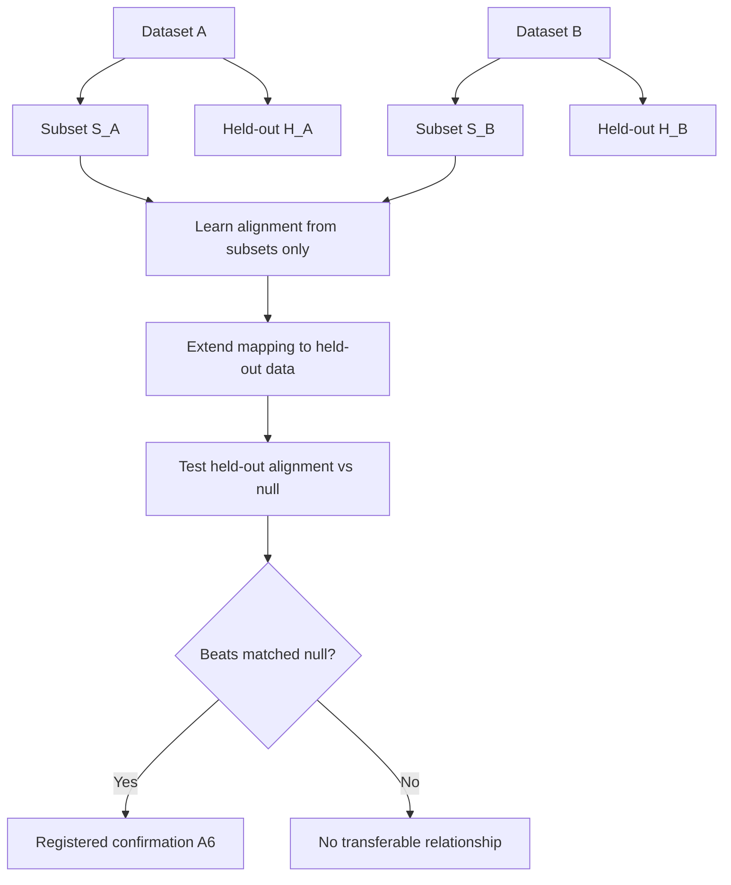
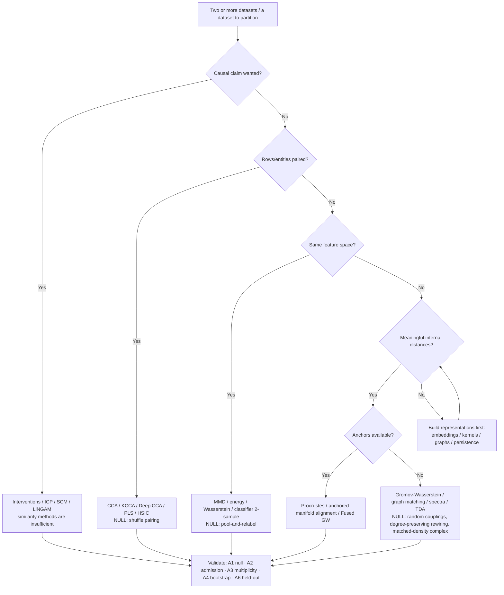

# CROSS-DATASET & SUBSET-TO-WHOLE FRAMEWORK

**A relational extension of the Structure Discovery Laboratory.**
Where the core lab asks *"does one sequence deviate from its declared null on the four
faces of randomness?"*, this document asks the relational questions: *"do two datasets
share structure beyond chance?"* and *"can a subset reconstruct the held-out remainder
better than a matched null?"*

This is not a standalone method catalogue. It inherits the lab's calibration
constitution wholesale — **single-null calibration (A1)**, **null-trial admission (A2)**,
**equivalence-class multiplicity (A3)**, **asymmetric verdicts (A4)**, **era gating
(A5)**, **registered held-out confirmation (A6)**, and **layered one-way flow (A7)** —
and adds a *fifth face of structure* (relational) plus the machinery to test it. Every
method below states its assumptions, what it can prove, what it cannot prove, and the
null it must beat. A method that returns an answer (and most here always do — GW always
returns a coupling, CCA always returns correlated components) is worthless until that
answer is shown to beat a matched null. That principle is non-negotiable and is the only
reason this framework exists.

> **Reading order.** This sits after `THEOREM_SYNTHESIS.md` (the four-face theory map)
> and before domain-porting in `RUNBOOK.md`. It reuses the onboarding protocols in
> `THEOREM_GOVERNANCE.md` Parts 3–4 verbatim: a new alignment instrument is onboarded
> exactly like a new theorem (Part 3), and a second dataset is onboarded exactly like
> the first (Part 4). Nothing here overrides the constitution; it specializes it.

---

## 0. Where this fits — the fifth face

`THEOREM_SYNTHESIS.md §1` decomposes "random" into four faces, each the extremal
property of an i.i.d.-uniform process: **statistical** (uniform marginals),
**dynamical** (future ⊥ past), **algorithmic** (incompressible), and
**cross-sectional/physical** (no collective modes). All four are *within-dataset*
properties of one object.

Relational structure is a distinct face because it is a property of a *pair* (or a
*partition*) of objects, not of one object:

| Face | Defining property | Null that destroys it | Instruments |
|---|---|---|---|
| **Relational (this doc)** | two datasets share more structure than independent generation predicts; or a subset determines the whole | independence / shuffled pairing / matched-marginal regeneration | MMD, energy distance, Wasserstein, Gromov–Wasserstein, CCA family, HSIC, persistence-diagram distances, graph matching, coresets, matrix completion |

The extremal fact that organizes the four within-dataset faces — i.i.d. uniform is
simultaneously extremal on all of them — has a relational analogue that organizes this
face: **two independently generated datasets are extremal on the relational face**
(every cross-statistic sits at its null expectation, every coupling is no better than a
random coupling, every subset predicts the remainder no better than the marginal). The
job of every instrument here is to measure a functional whose extreme value is attained
exactly at independence, and then to show the observed value is *not* extremal — against
a null that preserves everything except the relationship being claimed.

---

## 1. Problem framing

### 1.1 What "structure" means inside a dataset

Structure is **any property that lets you compress, predict, or reconstruct part of the
data from another part at a rate better than the declared null model permits.** This is
deliberately the same definition the lab already uses on the algorithmic face (entropy
floor / incompressibility) — structure is the complement of irreducible entropy. A
dataset with no structure is one where the held-out part is conditionally independent of
the observed part given the marginals, i.e. the entropy floor equals the raw entropy.
Operationally, for each dataset \(D_i\) the lab already builds a representation bundle:

\[
R_i = \{X_i,\; d_i,\; G_i,\; P_i,\; T_i\}
\]

a numeric/embedding matrix \(X_i\), a pairwise distance matrix \(d_i\), a k-NN graph
\(G_i\), an empirical distribution \(P_i\), and a topological summary \(T_i\)
(persistence diagrams). "Structure" is then any non-null regularity in any of these
representations; the four faces partition the within-dataset case, and §0's fifth face
covers the relational case.

### 1.2 What "relationship" means between datasets

A relationship is **a constraint linking \(D_A\) and \(D_B\) such that knowing the
representation of one reduces uncertainty about the other beyond what their separate
marginals already determine.** This must be stated as one of the eight claim types below
*before* a method is chosen, because each demands different evidence and a different
null. Conflating them is the most common way false relationships are manufactured.

| Claim type | Precise statement | Minimal evidence | Required null |
|---|---|---|---|
| Distributional similarity | \(P_A = P_B\) in a shared feature space | two-sample test fails to reject | pool-and-relabel permutation |
| Cross-dataset similarity (scalar) | a structural distance \(T(D_A,D_B)\) is small | \(T\) below null quantile | matched-marginal regeneration |
| Cross-dataset alignment (map) | a correspondence \(\pi: D_A \to D_B\) preserves structure | \(\pi\) distortion below null | random / shuffled couplings |
| Subset-to-whole recovery | a model \(M_S\) from subset \(S\) reconstructs held-out \(H\) | held-out error below null | marginal / permuted-\(H\) baseline |
| Predictive generalization | representation of \(A\) predicts held-out \(B\) | held-out skill > chance | shuffled \(A\!-\!B\) pairing |
| Latent-factor sharing | a common \(z\) generates both views | recovered \(z\) correlates across views on held-out rows | shuffled pairing |
| Topological correspondence | shared \(H_0/H_1/H_2\) features | bottleneck distance below null | matched-density geometric null |
| Causal relationship | intervening on \(A\) changes \(B\) | invariance / intervention test | observational-only data is **insufficient** |

### 1.3 The six discovery modes, distinguished

- **Within-dataset structure discovery** — the core lab's job: deviation of one object
  from its single-null model on any face. No second dataset, no partition.
- **Cross-dataset similarity** — a *scalar* verdict: is \(T(D_A,D_B)\) smaller than a
  null comparison would give? Answers "are these alike?", not "how do they correspond?".
- **Cross-dataset alignment** — a *map* verdict: is there a correspondence \(\pi\) whose
  structural distortion beats random couplings? Strictly stronger than similarity and
  strictly more prone to false positives (the search space of couplings is enormous).
- **Subset-to-whole recovery** — a *partition* of one dataset, \(D = S \cup H\): does
  structure learned only from \(S\) predict/reconstruct \(H\) better than the marginal?
- **Predictive generalization** — held-out skill of a learned relationship, the only
  thing the constitution (A6) accepts as confirmation.
- **Causal relationship discovery** — directional, requires interventions, time order,
  or environment heterogeneity. Similarity and alignment **never** establish it.

### 1.4 Why arbitrary datasets appear related (the look-elsewhere trap, restated)

This is the relational form of the lab's existing scan-statistic / look-elsewhere
concern (`kb/scan-statistics-look-elsewhere.md`, conflict C3). Three independent
mechanisms manufacture spurious cross-dataset relationships:

1. **Method overcompleteness.** Gromov–Wasserstein, CCA, and graph matching are
   *optimizers*: they return the best coupling/projection/matching that exists, even
   between two independent noise clouds. The output is never empty, so its mere
   existence is zero evidence. Only its position in the null distribution is evidence.
2. **High-dimensional coincidence.** In \(p\) dimensions with \(n\) samples, two
   independent Gaussians admit projections with arbitrarily high sample correlation when
   \(p \gtrsim n\) — CCA will find them. This is the relational face of the
   Marchenko–Pastur / random-matrix concern already in the lab (`kb/marchenko-pastur-tracy-widom.md`).
3. **Representation degrees of freedom.** Each dataset can be embedded, kernelized,
   graph-ified, or filtered many ways. Searching over representations until a
   relationship appears is multiplicity laundering and must be charged to the budget
   (A3, H4) exactly as statistic classes are.

The constitutional answer is unchanged: **the null model must preserve every nuisance
property — marginals, dimension, sample size, autocorrelation, degree distribution —
and destroy only the relationship being claimed.** A relationship is real only if it
survives a null built that way (A1), and only if the surviving instrument was admitted
by passing that null on independence first (A2).

---

## 2. Dataset relationship taxonomy

The correct method is almost entirely determined by *what the two datasets share*. This
table is the relational analogue of the four-face map and is the entry point to the
decision tree in §10.2.

| Case | What is shared | Example | Method families | Hard limit |
|---|---|---|---|---|
| **Same rows, different features** | row identity (paired) | same patients: genomics + MRI | CCA, KCCA, Deep CCA, PLS, HSIC, mutual information, information bottleneck | needs the pairing to be *correct*; shuffled-pairing null is mandatory |
| **Same feature space, different samples** | coordinate system | two customer cohorts, same columns | MMD, energy distance, Wasserstein, classifier two-sample test | tests *difference*; equality of distribution ≠ relatedness of meaning |
| **Different features, known anchors** | a partial correspondence | matched sensors, bilingual lexicon | Procrustes, semi-supervised manifold alignment, anchored GW | anchors must be trustworthy; few bad anchors wreck Procrustes |
| **Different features, no anchors** | only internal geometry | text embeddings vs 3-D point cloud | Gromov–Wasserstein, graph matching, persistence-diagram comparison, graph spectra | many equally-good alignments may exist; coupling needs a null |
| **Multiple views, one phenomenon** | a latent generator | audio + video + IMU of one event | alternating diffusion, multi-view latent models, shared-latent CCA | identifiability of the shared latent is assumption-heavy |
| **Temporal datasets** | a shared clock | markets vs neural firing | cross-correlation, DTW, Granger, transfer entropy, convergent cross mapping | autocorrelation inflates everything → block/phase nulls (A5) |
| **Graph-structured datasets** | relational topology | two social/protein networks | graph spectra, graph kernels, graph matching, community recovery, GW on shortest-path metrics | label permutation symmetry → degree-preserving null mandatory |
| **Causal-claim datasets** | a mechanism | treatment + outcome | interventions, ICP, SCM, LiNGAM, NOTEARS, Granger (weak) | observational similarity is **never** sufficient |

> **Constitutional note on the paired cases.** CCA, Deep CCA, information bottleneck,
> and PID require paired observations or a joint distribution. They are *not* a first
> tool for two independent datasets with no row alignment, no shared clock, and no
> anchors. Misapplying them to unpaired data is the single most common error in this
> space; the framework forbids it at the decision tree (§10.2) and the null (shuffled
> pairing) is what exposes it when it slips through.

---

## 3. Methods — assumptions, proof power, and nulls

Each method gets the same four-field treatment the lab applies to theorem cards in
`docs/kb/`: **assumes**, **proves**, **cannot prove**, **null**. New instruments here
must be onboarded via Governance Part 3 (KB card → face assignment → conflict scan →
null trial → class assignment → first dual report → ledger row) before touching any real
dataset. Candidate KB cards: `gromov-wasserstein.md`, `mmd-energy-distance.md`,
`tda-persistence-distances.md`, `cca-family.md`, `graph-matching-spectra.md`,
`coresets-landmarks.md`, `matrix-completion-compressed-sensing.md`.

### 3.1 Distributional comparison — same feature space

**Maximum Mean Discrepancy (MMD).** Kernel mean embedding distance,
\(\mathrm{MMD}^2(P,Q)=\mathbb{E}[k(X,X')]+\mathbb{E}[k(Y,Y')]-2\mathbb{E}[k(X,Y)]\).
*Assumes* a shared feature space and a characteristic kernel (with a kernel-bandwidth
choice that is itself a multiplicity dimension). *Proves* \(P=Q\) iff population MMD\(=0\)
(characteristic kernel). *Cannot prove* that two datasets are semantically or causally
related — only distributional (in)distinguishability. *Null*: pool both samples and
relabel (exchangeability), the relational form of the lab's pooled permutation.

**Energy distance / Wasserstein distance.** *Assumes* shared metric space; Wasserstein
additionally assumes the cost metric is meaningful. *Proves* distributional difference
with interpretable magnitude (Wasserstein = optimal transport cost). *Cannot prove*
correspondence between points (the transport plan is a by-product, not a validated map —
see §3.3). *Null*: pool-and-relabel.

**Classifier two-sample test.** Train a classifier to tell \(A\) from \(B\); held-out
accuracy near chance ⇒ indistinguishable. *Assumes* an honest train/test split (A6
discipline). *Proves* difference (high accuracy) under the chosen representation.
*Cannot prove* relatedness — only that they differ. *Null*: labels permuted; expected
accuracy = base rate.

### 3.2 Paired multi-view — same rows

**CCA / Kernel CCA / Deep CCA / PLS.** Find projections maximizing cross-view
correlation. *Assumes* **correctly paired rows** and (linear CCA) linear relationships;
KCCA/DCCA relax linearity at the cost of more capacity and more overfitting. *Proves*,
on **held-out pairs**, that shared linear/nonlinear structure exists. *Cannot prove*
anything when rows are unpaired, and in-sample canonical correlations are near-1 by
construction when \(p \gtrsim n\) (this is the high-dim coincidence of §1.4.2). *Null*:
**shuffle the pairing** and confirm held-out canonical correlation collapses to the
shuffled distribution. In-sample correlation is never evidence.

**HSIC / mutual information.** Dependence measures between paired variables. *Assumes*
pairing; MI estimation in high dimensions is biased and assumption-heavy. *Proves*
statistical dependence (HSIC\(=0\) iff independent, characteristic kernel). *Cannot
prove* direction or linear interpretability. *Null*: permute one variable's row order.

**Information bottleneck / PID.** *Assumes* a designated relevance/target variable.
*Proves* how much of \(X\) is predictive of \(Y\) at a given compression. *Cannot* be
used as a generic unpaired dataset-comparison tool — it needs \(Y\). Flagged here only
to forbid its misuse.

### 3.3 Intrinsic geometry — different features, no anchors

**Gromov–Wasserstein (GW) / Fused GW.** Couples two metric-measure spaces by minimizing
pairwise-distance distortion,
\(\sum_{i,j,k,l}|C_X(i,k)-C_Y(j,l)|^2\,\pi_{ij}\pi_{kl}\); Fused GW adds a feature term
when partial feature correspondence exists. *Assumes* meaningful internal distances and
comparable intrinsic structure. *Proves* (vs null) that the two relational structures are
more alignable than chance. **Critically — GW always returns a coupling**, so the
coupling is evidence *only* relative to a null of random/shuffled couplings; this is the
exact relational form of A2/A4. *Null*: GW distance against couplings of independently
regenerated \(C_Y\) with matched marginals/spectrum. *Library*: POT.

**Procrustes (anchored).** *Assumes* trustworthy anchors / known correspondence on a
subset. *Proves* a rigid (rotation+scale) alignment minimizing anchor error. *Cannot*
recover nonlinear warps; few corrupted anchors dominate the fit. *Null*: random anchor
relabeling.

**Manifold alignment (semi/unsupervised).** *Assumes* both datasets lie near
low-dimensional manifolds sharing a latent coordinate system. *Proves* (with anchors)
a shared embedding. *Cannot* be trusted unsupervised — many equally plausible alignments
exist. *Null*: alignment quality on shuffled/anchorless regeneration.

### 3.4 Topology — coordinate-free shape

**Persistent homology + bottleneck / diagram-Wasserstein distance.** *Assumes* the
filtration scale is meaningful and density is comparable. *Proves* shared global shape
features (\(H_0\) components, \(H_1\) loops, \(H_2\) voids) are stable — the
stability theorem \(d_B(D(f),D(g))\le\|f-g\|_\infty\) guarantees diagrams are robust to
small perturbations. *Cannot prove* that two datasets are identical: distinct spaces can
share a persistence diagram. *Null*: matched-density random geometric complex. *Witness
complexes* (§4.4) extend this to the subset case. *Libraries*: Ripser.py, GUDHI,
giotto-tda.

### 3.5 Graphs

**Graph spectra / kernels / matching / community recovery.** *Assumes* the graph
encodes the relation of interest; matching assumes comparable node semantics. *Proves*
(vs null) shared spectral/community/motif structure. *Cannot* escape label-permutation
symmetry without it — so the null **must** be degree-preserving (configuration model),
never plain Erdős–Rényi, which is too weak. *Null*: degree-preserving rewiring + SBM
with matched community sizes. *Libraries*: NetworkX, graspologic, igraph. (Connects to
the lab's existing `graphon_cooccurrence.py` and `kb/graphons-cut-norm.md`.)

### 3.6 Subset-structure methods (feed §4)

| Method | Assumes | Proves | Cannot prove | Null |
|---|---|---|---|---|
| **Coresets** | objective-specific sensitivity bound | \(L(M_S,D)\le L(M_D,D)+\epsilon\) for the target objective | structure for objectives outside the bound | uniform-random subset baseline |
| **Matrix completion** | low rank + incoherent sampling | hidden entries recoverable to RMSE bound | recovery of high-rank / arbitrary data | scrambled-entry / random low-rank null |
| **Compressed sensing** | sparsity in a known basis + structured (RIP) measurements | full-signal recovery from \(\ll n\) measurements | recovery from arbitrary *row* subsampling | random dense signal |
| **Nyström / landmarks** | structure lives in a kernel/Laplacian | \(K\approx CW^\dagger C^\top\) approximates spectrum/geometry | fidelity beyond the kernel's reach | random-landmark vs informed-landmark |
| **Leverage-score / CUR** | strong low-rank linear-algebraic structure | influential rows/cols reconstruct the matrix | structure not captured by leverage | uniform-row sampling |
| **Witness complexes** | landmarks + witnesses sample the same space | landmark topology ≈ full topology | identity of two spaces | matched-density landmark null |

---

## 4. Subset-to-whole recovery

Formalize the partition as \(D = S \cup H\): \(S\) the selected subset, \(H\) the
held-out remainder, \(M_S\) the structure learned **only** from \(S\). The experiment
tests whether \(M_S\) can derive \(H\) better than a matched null. This is the lab's
held-out-confirmation discipline (A6) turned inward on a single dataset, and it is the
cleanest relational test because the ground truth (\(H\)) is known exactly.

### 4.1 The impossibility that bounds everything

No method recovers \(H\) from \(S\) for an *arbitrary* dataset: given \(S\), infinitely
many full datasets \(D_1,D_2,\dots\) contain that exact \(S\) with completely different
remainders. Subset-to-whole recovery is possible **only** under a recoverability
assumption — redundancy, low rank, sparsity, smooth manifold geometry, stable topology,
repeated motifs, shared latent variables, or low description length. The research
question is therefore never "can we recover \(H\)?" but **"under which assumption, and
does that assumption demonstrably hold for this data — i.e. does recovery beat the
matched null?"** A flat recovery curve (§4.5) at the null line is the honest answer that
no such assumption holds — and is exactly the kind of negative result the lab is built to
report (cf. the lottery entropy floor).

### 4.2 Selection strategies and what each preserves

| Strategy | Preserves | Best for | Note |
|---|---|---|---|
| Uniform random | marginal distribution | the baseline null | always run; everything is measured against it |
| Stratified | category proportions | labeled/grouped data | needs honest strata |
| k-medoids / prototypes | representative centers | clustering, summarization | |
| Farthest-first traversal | geometric coverage | manifolds, point clouds | good for Nyström/landmarks |
| Leverage-score | low-rank linear structure | matrix approx, regression | interpretable rows/cols |
| Coreset (sensitivity) | a specific objective | scalable structure approximation | bound is objective-bound |
| Active / adaptive | informative regions | iterative discovery | risks optimistic bias → strict held-out |

### 4.3 Recovery meanings and their tests

| "Derive the rest" means | Test | Methods |
|---|---|---|
| Reconstruct missing values | fill hidden entries | matrix completion, low-rank imputation |
| Predict unseen rows | subset-trained rules predict \(H\) | regression, classification, generative models |
| Preserve clusters | subset clusters explain full data | coresets, k-medoids |
| Preserve geometry | distances/neighborhoods held | Nyström, landmark manifold extension |
| Preserve topology | loops/branches/components held | witness complexes, persistent homology |
| Preserve distribution | subset approximates full \(P\) | coresets, sketches, stratified sampling |
| Transfer a cross-dataset map | subset alignment generalizes | anchors, Procrustes, GW landmarks (→ §5) |

### 4.4 Witness-complex recovery (topology from a subset)

Select landmarks \(S\); use the remaining points as witnesses; build the witness complex;
compute persistent homology; compare to full-data persistence by bottleneck distance.
*Proves* (vs matched-density landmark null) that the subset preserves global shape.
*Cannot prove* metric identity. The honest report is the bottleneck distance between
landmark-diagram and full-diagram, with the null band.

### 4.5 The structure-recovery curve (the headline deliverable)

For subset fractions \(k\in\{1\%,2\%,5\%,10\%,20\%,40\%\}\): select \(S_k\), hold out
\(H_k\), learn \(M_{S_k}\) from \(S_k\) only, predict/reconstruct \(H_k\), compare to the
matched null, repeat over many seeds, and plot subset fraction → null-adjusted recovery
quality with bootstrap bands.

| Curve shape | Interpretation |
|---|---|
| small subset already good | strong compressible/redundant structure |
| smooth rise with \(k\) | real but noisy structure |
| flat at the null line | no reusable structure (honest negative — the lottery outcome) |
| unstable across seeds | local/spurious; fails A4 bootstrap stability |
| only works near full data | high-complexity or badly-represented structure |

---

## 5. Cross-dataset subset alignment

Extend §4 to two datasets: \(D_A=S_A\cup H_A\), \(D_B=S_B\cup H_B\). Learn the
relationship **only** from \(S_A,S_B\); test whether it generalizes to \(H_A,H_B\). This
is the strongest practical claim the framework can make and the most demanding:

> A relationship learned from a fraction of each dataset aligns/predicts the held-out
> remainder significantly better than null alignments — registered before the held-out
> data is touched (A6).



Methods: landmark-based GW alignment; manifold alignment; graph matching; Procrustes
when anchors exist; topology-preserving alignment (witness complexes on both sides). The
held-out tests and their metrics are in §8. The discipline is non-negotiable: the
alignment is *fit* on \(S\), *frozen*, then *scored once* on \(H\) — exploration on \(H\)
voids the result under A6/A7.

---

## 6. Validation & proof framework

This section maps the brief's validation requirements onto the lab's existing
constitution rather than duplicating it. The mapping is the whole point of folding the
two together.

| Brief requirement | Lab article / step | How it specializes for the relational face |
|---|---|---|
| Permutation tests | A1 + H4 + `kb/permutation-tests.md` | the permutation is *cross-dataset*: shuffle pairings, relabel pooled samples, rewire graphs preserving degree |
| Bootstrap stability | A4 power disclosure | resample within each dataset; relationship must survive |
| Held-out validation | **A6** registered confirmation | fit on \(S\)/train, freeze, score once on \(H\)/test |
| Negative controls | A2 null-trial admission | the instrument must return *null* on independent data before admission |
| Positive controls | Part 3 Step 4 | planted-structure data the instrument must detect |
| Synthetic planted structure | §7 experiments | the benchmark suite below |
| Matched null models | **A1** single-null calibration | one executable generator per claim, preserving all nuisances |
| Multiple-testing correction | **A3** + H1 + H4 | count *representation×method×metric* classes, not raw tests |
| Sensitivity analysis | C1/C8 + metric-robustness | vary kernel, metric, embedding; a relationship that survives only one is suspect |

### 6.1 Test statistic and permutation p-value

Define a score \(T(D_A,D_B)\) (larger = stronger relationship; negate distances). The
permutation p-value uses the lab's mandatory \(+1\) correction
(`kb/permutation-tests.md`, Phipson–Smyth — permutation p-values must never be zero):

\[
p = \frac{1 + \#\{T_{\text{null}} \ge T_{\text{obs}}\}}{m+1}.
\]

### 6.2 Null models by data type (the relational null table)

This is the relational extension of the lab's null tables. The rule from §1.4 governs
every row: **preserve every nuisance, destroy only the claimed relationship.**

| Data type | Too-weak null (forbidden as sole control) | Required null |
|---|---|---|
| Paired rows | Gaussian replacement | **shuffle the pairing** |
| Same-space samples | arbitrary random sample | pool-and-relabel permutation |
| Time series | row shuffle (destroys autocorrelation) | block shuffle / phase randomization / circular shift (A5) |
| Graphs | Erdős–Rényi at matched density | degree-preserving rewiring; SBM with matched community sizes |
| Topology | random cloud, different density | matched-density random geometric complex |
| Embeddings | random vectors | unrelated embeddings, matched dimension & norm distribution |
| Matrix data | random matrix | preserve marginals/covariance/rank (regenerate, don't scramble) |
| Subset-to-whole | predict \(H\) from nothing | marginal-only baseline + permuted-\(H\) baseline |

### 6.3 Required checks (the relational checklist)

Permutation/randomization test (false-positive control); bootstrap stability (A4);
subsample stability; metric sensitivity (avoid one-metric dependence, C8); negative
controls (A2); positive controls (Part 3 Step 4); held-out generalization (A6);
multiple-testing correction over representations and methods (A3/H4). A relationship
must clear **all** of these, and a single admissible flag against it (e.g. it vanishes
under a correct null) defeats the claim under A4 — passes never outvote a flag.

---

## 7. Reliable experiments (the benchmark suite)

Each experiment is specified with **hypothesis · data-generating process · method ·
expected result · failure mode · evaluation metric**. These double as the positive/
negative controls required by A2 and Part 3 Step 4: an instrument is admitted only if it
passes its negative control (silence on independence) *and* its positive control
(detection of planted structure). All seeded and deterministic per the output contract.

### E1 — Independent Gaussian negative control
**Hypothesis** \(H_0\): \(A\sim\mathcal N(0,I_p)\), \(B\sim\mathcal N(0,I_q)\) share no
relationship. **DGP**: independent draws, vary \(p,q,n\). **Method**: every instrument
(MMD, GW, CCA, graph matching). **Expected**: false-positive rate \(\approx\alpha\) (5%).
**Failure mode**: GW/CCA "find" structure → instrument not admissible (A2). **Metric**:
empirical FPR vs nominal \(\alpha\); p-value calibration (uniform on \([0,1]\)).

### E2 — Planted shared latent structure
**Hypothesis**: a common \(z_i\in\mathbb R^k\) generates both views, recoverable.
**DGP**: \(A_i=f_A(z_i)+\epsilon_A\), \(B_i=f_B(z_i)+\epsilon_B\) (circle, Swiss roll,
tree, clusters, Lorenz). **Method**: TDA/GW/manifold alignment (unpaired), CCA family
(paired). **Expected**: recovery rises with \(n\), degrades smoothly with noise, dies
under shuffled pairing. **Failure mode**: in-sample CCA correlation near 1 mistaken for
signal. **Metric**: correlation of recovered components with \(z\) on **held-out** rows.

### E3 — Topology positive & negative controls
**Hypothesis**: persistence distinguishes shapes. **DGP**: noisy circle, sphere, torus,
Gaussian blob, two clusters, tree. **Method**: persistent homology + bottleneck.
**Expected**: circle → persistent \(H_1\); blob → no dominant loop; sphere → \(H_2\);
tree → branching \(H_0\). **Failure mode**: density mismatch fakes a loop. **Metric**:
bottleneck distance vs matched-density null band.

### E4 — Same- vs different-distribution two-sample
**Hypothesis**: MMD/energy/Wasserstein detect a shift. **DGP**: case 1
\(A,B\sim\mathcal N(0,I)\); case 2 \(B\sim\mathcal N(\mu,I)\), sweep \(\|\mu\|\).
**Method**: MMD, energy distance, classifier two-sample. **Expected**: case 1 rejection
\(\approx\alpha\); case 2 power ↑ with \(\|\mu\|\). **Failure mode**: bandwidth tuned to
inflate power (uncharged multiplicity). **Metric**: FPR, power curve, p-value calibration.

### E5 — Graph structure recovery
**Hypothesis**: two graphs from one SBM share recoverable community structure. **DGP**:
graph A (1000 nodes, 4 communities), graph B (800 nodes, same 4, relabeled), edge-rewire
noise. **Method**: spectra, community distribution, GW on shortest-path metric, graph
kernels. **Expected**: detected above null; signal drops under degree-preserving rewiring
and label-shuffled SBM. **Failure mode**: Erdős–Rényi null (too weak) passes everything.
**Metric**: spectral distance, ARI of recovered communities vs null.

### E6 — Paired multi-view recovery
**Hypothesis**: linear shared latent is recoverable and predictive. **DGP**:
\(z\sim\mathcal N(0,I)\), \(X=W_Xz+\epsilon_X\), \(Y=W_Yz+\epsilon_Y\). **Method**: CCA,
KCCA, Deep CCA, PLS. **Expected**: recovered components correlate with \(z\); held-out
\(X\) predicts held-out \(Y\); **shuffled pairing destroys it**; degrades with noise.
**Failure mode**: high-dim spurious canonical correlation. **Metric**: held-out canonical
correlation vs shuffled-pairing null.

### E7 — Known causal simulation
**Hypothesis**: causal methods recover direction \(X_1\to X_2\to X_3\); similarity
methods cannot. **DGP**: \(X_1=\epsilon_1\), \(X_2=f(X_1)+\epsilon_2\),
\(X_3=g(X_2)+\epsilon_3\). **Method**: LiNGAM/NOTEARS/ICP vs (as a control) GW/CCA.
**Expected**: causal methods recover the chain; similarity methods are direction-blind.
**Failure mode**: reading direction into a symmetric similarity score. **Metric**:
structural Hamming distance to true DAG; explicit note that similarity scores are
direction-agnostic by construction.

### E8 — Subset-to-whole on structured vs structureless data
**Hypothesis**: recovery curve rises for low-rank/manifold data, stays flat for noise.
**DGP**: low-rank matrix, sparse signal, Swiss-roll manifold — and an i.i.d.-uniform
control (the lottery analogue). **Method**: matrix completion, compressed sensing,
Nyström, witness complexes; full §4.5 curve. **Expected**: structured data beats null;
the i.i.d. control sits **on** the null line at every \(k\). **Failure mode**: leakage
between \(S\) and \(H\) (e.g. duplicate rows) fakes recovery. **Metric**: null-adjusted
recovery quality across subset fractions.

### E9 — Cross-dataset subset alignment, shuffled-pairing null
**Hypothesis**: a subset-learned alignment generalizes to held-out data. **DGP**: two
views of a shared manifold, partition each into \(S\) and \(H\). **Method**: landmark GW
/ manifold alignment fit on \(S_A,S_B\), scored once on \(H_A,H_B\). **Expected**:
held-out retrieval beats shuffled-pairing null; collapses when the shared latent is
removed. **Failure mode**: fitting on \(H\) (A6 violation). **Metric**: top-k held-out
retrieval accuracy vs null.

---

## 8. Metrics

| Structure type | Metric |
|---|---|
| Numeric reconstruction | RMSE, MAE, \(R^2\), held-out log-likelihood |
| Prediction | accuracy, F1, AUROC, calibration |
| Distance distortion | mean/max relative pairwise-distance error |
| Neighborhood preservation | trustworthiness, continuity, kNN overlap |
| Clustering recovery | adjusted Rand index, normalized mutual information, stability |
| Topology preservation | bottleneck distance, persistence-diagram Wasserstein distance |
| Graph structure preservation | spectral distance, community recovery (ARI), motif distribution |
| Distributional similarity | MMD, energy distance, Wasserstein |
| Cross-dataset alignment quality | retrieval / top-k match accuracy, GW distortion, coupling entropy |
| Held-out retrieval accuracy | fraction of \(H_A\) points whose true \(H_B\) match is in top-k |
| **Null-adjusted significance** | permutation p-value (\(+1\) corrected), z vs null, percentile of observed in null distribution |

Every reported number carries its null-adjusted significance; a raw score without its
null position is, by constitution, not a result.

---

## 9. Claims & limitations

State plainly, in increasing strength (mirrors `RESEARCH_NOTES.md` evidence standards):

- **Weak** — "they look similar under visualization." Exploratory only; never
  confirmatory (A7: exploration motivates, never confirms).
- **Moderate** — "similar geometry/topology under a specified metric, vs nulls."
- **Strong** — "a subset-learned relationship generalizes to held-out data and beats
  matched nulls" (registered, A6).
- **Strongest practical** — "significant against a domain-appropriate null, stable under
  bootstrap, robust across reasonable metrics, reproducible on held-out data, and
  recoverable in synthetic benchmarks with known ground truth."

Hard limitations, each load-bearing:

1. **Structural similarity is not causality.** Alignment/correlation/shared topology
   never establish a mechanism. Causal claims require interventions, time order, or
   environment heterogeneity (§3.2, E7).
2. **CCA-style methods require paired observations.** Unpaired use is invalid until a
   matching is independently established and validated.
3. **GW always returns a coupling.** The coupling is evidence only relative to a null;
   its existence proves nothing (A2/A4).
4. **Persistent homology gives stable summaries, not identity.** Similar diagrams ≠
   identical datasets; distinct spaces share diagrams.
5. **Subset recovery needs an assumption.** Redundancy, low rank, sparsity, smooth
   manifold, stable topology, repeated motifs, shared latent, or low description length —
   and the assumption must be *shown* to hold (recovery beats null), not assumed.
6. **Representation freedom is multiplicity.** Searching embeddings/kernels/graphs until
   a relationship appears must be charged to the budget (A3), or every result is an
   artifact of the search.

---

## 10. Deliverables

### 10.1 Research thesis

> Cross-dataset and subset-to-whole structure discovery is a *validated relational
> inference* problem, not a pattern search. For any claimed relationship we fix a
> representation, a score, a candidate-correspondence class, and a matched null that
> preserves all nuisances; we admit an instrument only after it is silent on independence
> and detects planted structure; we charge representation and method choices to the
> multiplicity budget; and we confirm only on registered held-out data. The headline
> evidence is a structure-recovery curve showing that a subset (or one dataset) predicts,
> reconstructs, or aligns the held-out remainder (or the other dataset) significantly
> better than a domain-appropriate null — or, just as valuably, that it does not.

### 10.2 Method-selection decision tree



### 10.3 Method → assumption → output → strength → weakness table

| Method | Assumes | Output | Strength | Weakness |
|---|---|---|---|---|
| MMD | shared space, characteristic kernel | distributional distance + p | exact \(P=Q\) test | bandwidth choice = multiplicity |
| Energy / Wasserstein | shared metric | interpretable distance | magnitude meaning | no validated point map |
| Classifier 2-sample | honest split | held-out accuracy | intuitive, flexible | detects difference only |
| CCA / KCCA / DCCA | paired rows | shared components | held-out predictive test | invalid unpaired; high-dim spurious corr |
| HSIC / MI | paired rows | dependence statistic | nonlinear dependence | direction-blind; MI bias |
| Gromov–Wasserstein | meaningful distances | coupling + distortion | no shared space needed | always returns a coupling → null-critical |
| Procrustes | trustworthy anchors | rigid alignment | simple, fast | anchor-corruption fragile |
| Manifold alignment | shared latent manifold | shared embedding | nonlinear | unsupervised ill-posed |
| Persistent homology | meaningful scale | persistence diagram | coordinate-free, stable | similarity ≠ identity |
| Graph spectra/matching | graph encodes relation | spectral/community/match | relational structure | permutation symmetry → strong null |
| Coresets | sensitivity bound | weighted subset | objective guarantee | objective-bound only |
| Matrix completion | low rank, incoherence | filled entries | recovery bound | fails high-rank |
| Compressed sensing | sparsity + RIP measurements | recovered signal | sub-Nyquist recovery | needs structured measurements |
| Nyström / CUR / leverage | low-rank / kernel structure | approximation | scalable, interpretable | misses non-low-rank structure |
| Witness complex | landmarks+witnesses cover space | subset topology | cheap topology | not identity proof |

### 10.4 Protocols (cross-referenced)

The **subset-to-whole protocol** is §4 (partition → learn on \(S\) → predict \(H\) →
null-adjust → recovery curve §4.5). The **cross-dataset alignment protocol** is §5 (fit
on \(S_A,S_B\) → freeze → score once on \(H_A,H_B\) → null). Both run under the six-phase
RUNBOOK and route through the AGENT_WORKFLOW (onboarder admits the second dataset and the
new instruments; analyst designs the null and interprets; editor writes results
copy-only).

### 10.5 Benchmark suite

The nine experiments of §7 are the registered benchmark suite. Minimal coverage matrix:
independent Gaussians (FPR), planted latent (geometric recovery), circle vs noisy circle
(topology positive) and circle vs blob (topology negative), distribution shift (two-sample
power), paired latent (multi-view) and its shuffled-pairing null, SBM graphs and the
degree-preserving null, causal chain (causal vs similarity), low-rank/sparse/manifold vs
i.i.d. control (subset recovery), and held-out cross-dataset alignment.

### 10.6 Pseudocode — experimental pipeline

```python
from dataclasses import dataclass
from typing import Callable, Dict, Any, Sequence
import numpy as np

@dataclass
class ExperimentResult:
    subset_size: float
    selector: str
    observed_score: float
    null_scores: Sequence[float]
    p_value: float
    metadata: Dict[str, Any]

def permutation_p_value(observed, null_scores, larger_is_better=True):
    null = np.asarray(null_scores)
    count = np.sum(null >= observed) if larger_is_better else np.sum(null <= observed)
    return (1 + count) / (len(null) + 1)          # +1: Phipson-Smyth, never zero

def subset_to_whole_experiment(D, subset_sizes, selectors, model_factory,
                               score_fn, null_generators, repeats=20,
                               larger_is_better=True):
    """A1 single-null + A2 admission + A6 held-out, on one partitioned dataset.
    Precondition (A2): every instrument in model_factory has already returned
    null on independent data and detected planted structure. Enforce upstream."""
    results = []
    for k in subset_sizes:
        for sel_name, selector in selectors.items():
            for r in range(repeats):
                S, H = selector(D, k, random_state=r)         # H is held out, never fit on (A6)
                model = model_factory(); model.fit(S)
                observed = score_fn(model, S, H, model.predict_or_extend(H))
                null_scores = []
                for gen in null_generators.values():          # matched-marginal nulls (A1)
                    Dn = gen(D, random_state=r)
                    Sn, Hn = selector(Dn, k, random_state=r)
                    m = model_factory(); m.fit(Sn)
                    null_scores.append(score_fn(m, Sn, Hn, m.predict_or_extend(Hn)))
                results.append(ExperimentResult(
                    k, sel_name, observed, null_scores,
                    permutation_p_value(observed, null_scores, larger_is_better),
                    {"repeat": r}))
    return results   # downstream: A3 multiplicity over (k x selector x method), A4 bootstrap bands
```

### 10.7 Python stack

| Need | Libraries |
|---|---|
| Numerics | NumPy, SciPy |
| Dataframes | pandas, Polars |
| ML | scikit-learn, PyTorch |
| Optimal transport / GW | **POT** (`pythonot`) |
| TDA / persistent homology | **Ripser.py**, **GUDHI**, **giotto-tda** |
| Graphs | NetworkX, graspologic, igraph |
| Two-sample / dependence tests | **hyppo**, scipy.stats, statsmodels |
| Manifold learning | scikit-learn, UMAP-learn, PyMDE |
| Matrix completion / low-rank | fancyimpute, sklearn.decomposition, custom nuclear-norm |
| Causal discovery | DoWhy, causal-learn, lingam, gCastle (NOTEARS) |
| Visualization | matplotlib, plotly, persistence-diagram plotters |
| Tracking | structured seeded logs (per output contract); MLflow/W&B optional |

### 10.8 References (foundational + practical)

*Distributional testing* — Gretton et al., "A Kernel Two-Sample Test," JMLR 2012;
Lopez-Paz & Oquab, "Revisiting Classifier Two-Sample Tests," arXiv:1610.06545.
*Permutation* — Phipson & Smyth, "Permutation P-values Should Never Be Zero," SAGMB 2010.
*Optimal transport / GW* — Mémoli, "Gromov–Wasserstein Distances and the Metric Approach
to Object Matching," FoCM 2011; Flamary et al., "POT: Python Optimal Transport," JMLR
2021. *TDA* — Cohen-Steiner, Edelsbrunner & Harer, "Stability of Persistence Diagrams,"
DCG 2007; Edelsbrunner & Harer, "Persistent Homology — A Survey"; de Silva & Carlsson,
"Topological Estimation Using Witness Complexes," 2004. *Paired multi-view* — Andrew et
al., "Deep Canonical Correlation Analysis," ICML 2013; Tishby, Pereira & Bialek, "The
Information Bottleneck Method," physics/0004057. *Subset-to-whole* — Feldman,
"Introduction to Core-sets: An Updated Survey," arXiv:2011.09384; Feldman & Langberg, "A
Unified Framework for Approximating and Clustering Data," STOC 2011; Candès & Recht,
"Exact Matrix Completion via Convex Optimization," FoCM 2009; Donoho, "Compressed
Sensing," IEEE-IT 2006; Williams & Seeger, "Using the Nyström Method to Speed Up Kernel
Machines," NIPS 2000; Drineas et al., "Fast Approximation of Matrix Coherence and
Statistical Leverage," JMLR 2012.

---

## 11. Per-experiment checklist (paste into RESEARCH_NOTES on every relational run)

- What is the exact claim type (§1.2) — similarity, alignment, recovery, prediction, or causal?
- What representation, distance/kernel/graph, and score?
- What matched null (§6.2), and does it preserve every nuisance but the relationship?
- Was the instrument admitted (A2: silent on independence, detects planted structure)?
- Does the observed score beat the null at the corrected p (§6.1)?
- Stable under bootstrap and subsampling (A4)?
- Robust across reasonable metrics/kernels (C8), with the multiplicity charged (A3)?
- Confirmed on registered held-out data only (A6)?
- Passes positive controls, fails negative controls (§7)?
- For subset claims: which recoverability assumption, and does the recovery curve show it?
- Known failure modes for this method listed?

---

*Relational extension v1.0 · 2026-06-11 · folds the cross-dataset / subset-to-whole
research brief into the Structure Discovery Laboratory constitution (A1–A7, E0–E9,
H1–H7, four-face map, onboarding Parts 3–4). Adds the fifth (relational) face; overrides
nothing.*
