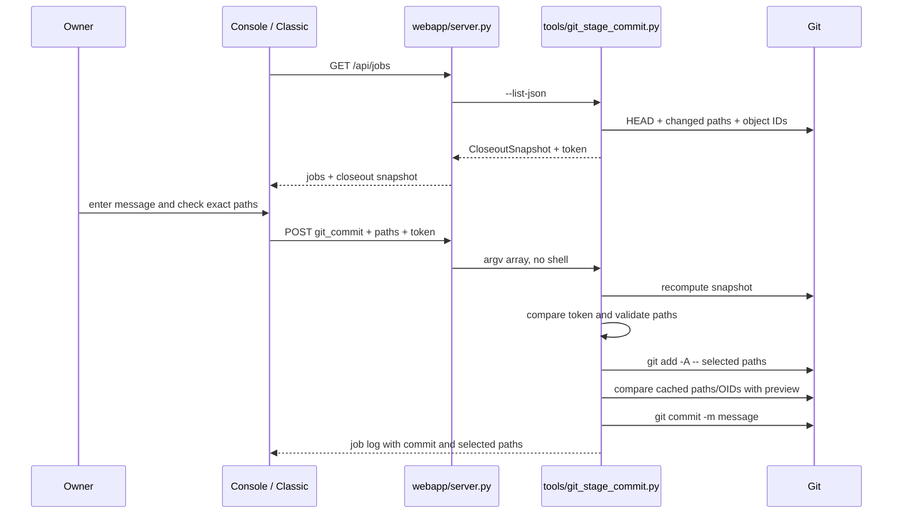

# LAB-RELIABILITY-M0 Operational Closeout Foundation Plan

## §1 Status

**Implemented, verified, and merged on 2026-07-10 after direct owner approval.**
Current stage: **COMPLETE AND MERGED via PR #17; independent-review exception
recorded in §19**.

| Field | Value |
|---|---|
| RFC | `n/a` |
| Parent requirements | `LAB-RELIABILITY-2026Q3` controls `C2`, `C6`, `C10`; Milestone 0 |
| Workplan episode | `n/a`; requirements source is `docs/LAB_IMPROVEMENT_PLAN.md` v1.1 |
| Target branch | `feature/lab-reliability-m0` |
| Pull request | `#17` -- merged into `master` on 2026-07-10 |
| Merge commit | `0265ed33b74ac5bc9d692c82d464c3c877e1d170` |
| Executor altitude (§0.1) | `low` |

The 2026-07-08 PCSO closeout was committed locally as `4d96820` before the
target branch was created. Slices S1-S3 landed as `369dd76`, `4be1e53`, and
`21410e6`, followed by completion record `400726d`. The latest `origin/master`
was merged at `1c4ef49`; additive conflicts were resolved without dropping the
GW or PCSO ledger rows. GitHub merged PR #17 as `0265ed3` after `lab-ci` passed.

## §2 Episode Search Summary

Commands run while authoring:

```bash
node /Users/charltondho/.episodic-memory/scripts/em-recall.mjs --project structure-discovery-lab --task-type implementation --scope all --limit 8
node /Users/charltondho/.episodic-memory/scripts/em-search.mjs --project structure-discovery-lab --query "implementation plan template workplan template" --scope all --limit 10 --full
```

Key active memories:

- `20260710-050050-console-redesign-workplan-complete-on-ma-a6bd`: the console
  workplan is complete; the July PCSO closeout is the current repository work.
- `20260704-025350-console-redesign-conventions-endpoint-vi-3928`: the default
  console and classic fallback share the real `/api/jobs` backend; browser tests
  intercept job POSTs and must not mutate joblogs.
- `20260704-042140-redesign-migration-of-the-original-app-s-d79a`: changes to a
  console workflow must preserve the corresponding classic workflow rather than
  silently dropping it.
- `feedback_plan_template_first`: use `docs/PLAN_TEMPLATE.md` §1-§20 and Appendix
  A at low-capability altitude; every MUST has a falsifiable test and every
  CREATE test step carries full source.
- `feedback_workplan_conventions`: implementation work is session-mapped and the
  eight-axis negative-scenario matrix is required for schema, gate, and
  multi-actor changes.

Freshness checks performed: `webapp/server.py` still owns `JOB_DEFS`,
`job_argv()`, and `/api/jobs`; `webapp/static/console.html` remains the default
UI; `webapp/static/index.html` remains the classic fallback; and
`src/pcso_weekly_update.py` reproduces the canonical July result.

## §3 Objective

Deliver a webapp-capable PCSO closeout path that recomputes the canonical result
without writing, reports the exact byte hash, and can commit only paths the owner
selected from a fresh repository preview. The implementation is proven by
unit, negative-control, repository-isolated Git, and live-browser tests.

The slice does not alter the registered statistics, input data, July result
bytes, evidence grade, or frozen history. The canonical result must remain SHA-256
`11c8af729f0353a83f130253100dadb5fb3413d49cceec11fa031d64daf054a4`.

## §4 Requirements (Ground Truth)

| ID | Requirement (concrete, testable) | Parent R | Test(s) | Priority | Notes / edge cases |
|---|---|---|---|---|---|
| REQ-1 | `pcso_weekly_update.py --verify` recomputes the canonical payload, compares complete bytes with the existing output, prints its SHA-256, and performs no repository write. | `C2`, `C10`, `M0.1` | `test_cli_verify_reproduces_canonical_hash_without_git_change`, `test_verify_accepts_exact_bytes_without_mutation`, `test_verify_rejects_mismatch`, `test_verify_rejects_missing` | MUST | Exact bytes, not parsed JSON equality. |
| REQ-2 | Normal PCSO output writes use a same-directory temporary file, `fsync`, and `os.replace`; an interrupted replacement leaves no partial target. | `C6` | `test_atomic_write_replaces_complete_payload`, `test_atomic_write_cleans_temp_on_replace_failure` | MUST | Existing serialization and canonical hash remain unchanged. |
| REQ-3 | `/api/jobs` exposes a `pcso_weekly_verify` gate whose argv is exactly the current Python executable, `src/pcso_weekly_update.py`, and `--verify`. | `M0.1` | `test_pcso_job_registered`, `test_pcso_job_argv_exact`, browser `pcso_weekly_verify` POST assertion | MUST | The job never uses `--out`. |
| REQ-4 | `/api/jobs` returns a closeout snapshot containing HEAD, every changed path and state, per-path Git object identities, and a deterministic preview token. | `M0.2`, `M0.3` | `test_preview_lists_states_and_token`, `test_closeout_snapshot_shape` | MUST | Paths are repo-relative POSIX strings. |
| REQ-5 | The default console displays the fresh path preview and sends only checked paths plus the preview token; the classic fallback sends the same fields. | `M0.2`, `M0.3` | `webapp/test_agents_e2e.py`, static contract assertions in `test_closeout_snapshot_shape` | MUST | Empty selection cannot POST. |
| REQ-6 | The commit runner accepts only unique, changed, allow-listed repository paths; it rejects absolute paths, `..`, backslashes, NUL, local metadata, and more than 200 paths. | `C6`, `M0.2` | `test_rejects_empty_duplicate_and_nonstring_paths`, `test_rejects_traversal_and_disallowed_roots`, `test_rejects_path_count_boundary` | MUST | Git stores symlinks as link objects; the tool never reads through them itself. |
| REQ-7 | The commit runner invokes Git with argv arrays and never interpolates a message or path into a shell command. | `C6`, `M0.2` | `test_git_commit_argv_is_shell_free`, `test_commit_message_is_literal_argument` | MUST | Commit messages beginning with `-` are consumed by `-m`. |
| REQ-8 | A preview from another repository, another HEAD, or an earlier worktree state is rejected before commit. | `C2`, `C6` | `test_rejects_stale_preview`, `test_rejects_cross_repo_token` | MUST | SHA-256 is an equality token, not an authentication secret. |
| REQ-9 | Existing staged paths outside the approved selection block the commit, and post-stage index identities must equal the previewed worktree identities. | `C6` | `test_rejects_pre_staged_unapproved`, `test_detects_change_between_preview_and_stage` | MUST | A failed post-stage identity check may leave selected paths staged but never commits them. |
| REQ-10 | An approved subset commit leaves every unapproved change in the worktree and commits exactly the selected path set. | `M0.2`, `M0.3` | `test_commit_only_selected_paths`, `test_deletion_is_committed_when_selected` | MUST | No repository-wide `git add`. |
| REQ-11 | Browser tests drive both new Run-centre actions while intercepting POSTs; no real verifier, commit, or joblog write occurs during E2E. | `M0.4`, `M0.5` | `webapp/test_agents_e2e.py` before/after joblog assertion | MUST | GET `/api/jobs` remains live except for deterministic injected closeout fixtures. |
| REQ-12 | The entire tranche leaves the July result hash and `G0` wording unchanged and passes existing numeric and webapp regression gates. | `C10`, operating constraints 1-2 | `test_cli_verify_reproduces_canonical_hash_without_git_change`, `python3 src/verify_relational_docs.py`, `python3 webapp/test_server.py` | MUST | No evidence upgrade. |

Priority legend: every row is **MUST** and blocks its slice merge. Every MUST
maps to an automated, non-skippable test.

## §5 Non-Goals

- Dependency locking and CI from Milestone 1.
- Registration/result/ledger JSON Schemas and the shared `lab` CLI from Milestone 2.
- New null models, sequential alpha allocation, random streams, Monte Carlo
  uncertainty intervals, or calibration batteries from Milestone 3.
- Official PCSO/GFZ acquisition, holdout sealing, role enforcement, and
  independent statistical recomputation from Milestone 4.
- Workbook generation and semantic-verifier replacement from Milestone 5.
- Retrospective repair or evidence-grade upgrade for the 2026-07-08 run.
- A generic Git client. The commit runner supports only reviewed lab paths and
  one exact selected-path commit operation.

## §6 Token Budget (Rule 12)

Line counts were measured on 2026-07-10 before plan authoring.

| File | `wc -l` | Reads (lines × ~5) | Writes | Notes |
|---|---:|---:|---:|---|
| `src/pcso_weekly_update.py` | 546 | 2,730 | ~55 | S1 verification and atomic write |
| `webapp/server.py` | 1,839 | 9,195 | ~55 | S2 job plus S3 snapshot/argv |
| `webapp/static/console.html` | 2,440 | 12,200 | ~65 | S3 checked-path modal |
| `webapp/static/index.html` | 1,558 | 7,790 | ~20 | S3 classic parity |
| `webapp/test_agents_e2e.py` | 150 | 750 | ~45 | S2/S3 browser assertions |
| `tools/git-sandbox.sh` | 22 | 110 | 0 | read-only Git convention |
| `docs/LAB_IMPROVEMENT_PLAN.md` | 309 | 1,545 | 0 | read-only requirements source; plan link added during authoring |
| New Python files | 0 | 0 | ~470 | runner tests, Git runner, Git tests |

**Baseline (single session):** ~145k tokens including ~38k session overhead and
review/verification output; this is above the preferred range.

**Optimized:** three sessions by dependency layer: S1 ~55k, S2 ~68k, S3 ~108k.
Each remains within the 60-130k working range after normal variance, with S1 a
valid quick-win session.

## §7 Safety / Security

The active agent policy forbids delegation unless the user requests it, so the
canonical negative-scenario planner could not be dispatched. The author performed
the required eight-axis walk directly.

| Concern | Severity | Attack/abuse scenario | Mitigation | Test(s) (incl. negative) |
|---|---|---|---|---|
| Shell injection | High | A path or commit message inserts shell operators. | All subprocesses receive argv arrays; `job_argv()` returns Python directly, never `sh -c`. | `test_git_commit_argv_is_shell_free`; `test_commit_message_is_literal_argument` |
| Path escape / local secret commit | High | Selection contains `../`, absolute paths, `.git`, `.claude`, `.DS_Store`, or local config. | Lexical POSIX validation plus explicit root-file/root-directory allowlists. | `test_rejects_traversal_and_disallowed_roots` |
| Stale or spliced preview | High | Approval for repository A or an older tree authorizes repository B/current changed bytes. | Token covers resolved root, HEAD, statuses, index OIDs, and worktree OIDs; runner recomputes it. | `test_rejects_stale_preview`; `test_rejects_cross_repo_token`; negative: `--break-stale-guard` |
| Pre-staged unrelated content | High | An earlier staged secret rides into the approved commit. | Cached path set must be a subset before staging and exactly the selection after staging. | `test_rejects_pre_staged_unapproved` |
| TOCTOU after preview | High | A selected file changes between token check and `git add`. | Post-stage index OID must equal its previewed worktree OID; mismatch fails before commit. | `test_detects_change_between_preview_and_stage` |
| Partial result write | Medium | Process stops while replacing result JSON. | Same-directory exclusive temp, flush, `fsync`, atomic replace, cleanup on exception. | `test_atomic_write_cleans_temp_on_replace_failure`; negative: `--break-atomic-write` |
| Verification mutates evidence | High | A Verify button silently rewrites the canonical artifact. | `--verify` serializes in memory and only reads the expected output. | `test_cli_verify_reproduces_canonical_hash_without_git_change`; negative: `--break-byte-compare` |
| Concurrent commit | Medium | Another Git process changes index/HEAD during the operation. | Git locking plus pre-stage token and post-stage index/HEAD checks; uncertainty fails closed. | `test_detects_change_between_preview_and_stage` |

### 7.1 Eight-axis negative-scenario coverage

| Axis | Plan source | Applies? | Coverage plan |
|---|---|---|---|
| Splice | REQ-8, Safety stale/spliced preview | YES | A token from temp repository A is submitted to B; `test_rejects_cross_repo_token` must raise `closeout preview is stale; refresh paths before committing`. |
| Forge / Stale | REQ-8 | YES | Mutate a selected file after preview; `test_rejects_stale_preview` fails before staging. |
| Orphan | REQ-6, REQ-8 | YES | Delete or create a selected path after preview; the recomputed snapshot differs and blocks. |
| Empty | REQ-5, REQ-6 | YES | Empty path list and empty browser selection are rejected without POST/commit. |
| Wrong-shape | REQ-6 | YES | Non-list paths, non-string members, malformed token, and duplicate paths are rejected. |
| Wrong-semantic | REQ-6, REQ-9 | YES | Unchanged/disallowed paths and pre-staged unapproved paths are rejected. |
| Race / TOCTOU | REQ-9 | YES | Test wrapper mutates the selected file immediately before real `git add`; post-stage OID comparison blocks commit. |
| Boundary | REQ-6 | YES | Test 0, 1, 200, and 201 selected paths plus 4/5/400/401-character messages. |

No axis is deferred.

## §8 Design

### 8.1 Key types

```python
from typing import TypedDict

class ChangeRecord(TypedDict):
    path: str
    staged: bool
    unstaged: bool
    untracked: bool
    worktree_oid: str | None
    index_oid: str | None
    allowed: bool
    rejection: str | None

class CloseoutSnapshot(TypedDict):
    root: str
    head: str
    changes: list[ChangeRecord]
    token: str
```

Browser payload:

```json
{
  "job": "git_commit",
  "params": {
    "message": "Close PCSO weekly batch",
    "paths": ["docs/example.md", "results/example.json"],
    "preview_token": "64-lowercase-hex-characters"
  }
}
```

### 8.2 Key invariants

- Verification compares the complete serialized bytes and never calls the writer.
- Normal serialization remains `json.dumps(..., indent=2, ensure_ascii=True) + "\n"`.
- A commit contains exactly the selected paths and no pre-existing unrelated staged path.
- The approved token binds repository root, HEAD, path states, worktree OIDs, and index OIDs.
- Every gate fails closed on missing, malformed, stale, or inconsistent state.
- Both web UIs use the same server snapshot and `job_argv()` implementation.
- **Cross-platform:** Python uses `pathlib`, `tempfile`, `os.replace`, subprocess
  argv arrays, and NUL-delimited Git output; no GNU-only flags or `sed -i`.
- **Atomicity:** PCSO result writes use temp plus replace. Git supplies index and
  reference locking; a post-stage mismatch never proceeds to `git commit`.

### 8.3 Resolution / flow



Verification flow:

```text
manifest + inputs -> validate -> compute result -> canonical bytes
    -> --verify: compare existing bytes -> print PASS + SHA-256, write nothing
    -> normal: temp write -> fsync -> os.replace -> print output path
```

## §9 Existing Hook Points

Line numbers are the 2026-07-10 authoring snapshot and are paired with stable
anchors in Appendix A.

| File | Line(s) | What it does today | Impact of this change |
|---|---:|---|---|
| `src/pcso_weekly_update.py` | 68-69 | `sha256()` hashes files. | Add canonical byte serialization, exact verification, and atomic writes nearby. |
| `src/pcso_weekly_update.py` | 518-542 | `parse_args()` and `main()` always write `--out` directly. | Add `--verify`; route verify and normal writes separately. |
| `webapp/server.py` | 659-732 | `JOB_DEFS` declares the whitelist. | Add `pcso_weekly_verify`; change `git_commit` needs to message plus paths. |
| `webapp/server.py` | 737-774 | `job_argv()` builds agent and shell-based commit commands. | Replace `sh -c` commit construction with shell-free Python argv. |
| `webapp/server.py` | 806-817 | `jobs_state()` returns definitions and live jobs. | Add `closeout` snapshot returned by the Git tool. |
| `webapp/static/console.html` | 1680 | Run-centre state has `_agTimer` and `_openLog`. | Add the current closeout snapshot. |
| `webapp/static/console.html` | 1805-1815 | `runJob()` collects only a commit message. | Add checked-path modal and token submission. |
| `webapp/static/index.html` | 1001-1006 | Classic Run centre fetches jobs. | Retain the closeout snapshot for fallback commits. |
| `webapp/static/index.html` | 1068-1077 | Classic `runJob()` collects only a message. | Collect selected paths and submit the same token. |
| `webapp/test_agents_e2e.py` | 41-146 | Live GETs plus intercepted job POSTs; joblogs must not change. | Add deterministic closeout fixtures and assert both new actions. |

## §10 Slice Ladder

| Slice | Objective | Primary files | Key deliverables | Tests | Hard stops (do NOT do in this slice) |
|---|---|---|---|---|---|
| `LR-M0-S1` | Non-mutating canonical PCSO verification and atomic normal writes | `src/pcso_weekly_update.py`, `webapp/test_pcso_closeout.py` | `--verify`, exact byte comparison, atomic writer | runner unit/CLI suite + two break controls | No server/UI/Git changes; no result regeneration committed. |
| `LR-M0-S2` | Expose canonical verification through both Run-centre views | `webapp/server.py`, `webapp/test_pcso_closeout.py`, `webapp/test_agents_e2e.py` | whitelisted `pcso_weekly_verify` job | unit break control + live browser POST assertion | No commit workflow changes. |
| `LR-M0-S3` | Token-bound selected-path preview and commit | `tools/git_stage_commit.py`, `tools/test_git_stage_commit.py`, server, both UIs, closeout/E2E tests | snapshot token, path gate, shell-free commit, checked-path UI | isolated Git suite + server unit + live browser negative/green | No generic Git operations, dependency work, registration schema, or scientific-method changes. |

### 10.1 Dependency graph

```text
LR-M0-S1 -> LR-M0-S2 -> LR-M0-S3
```

All arrows are hard dependencies. Each slice is one commit and one reviewable
concern.

### 10.2 Session map

| Session | Slice | Estimated tokens | Sweet-spot status | Combine candidates |
|---|---|---:|---|---|
| S1 | `LR-M0-S1` | ~55k | Below but efficient quick win | Do not combine; canonical hash is a hard checkpoint. |
| S2 | `LR-M0-S2` | ~68k | In range | None; pause after live-browser proof. |
| S3 | `LR-M0-S3` | ~108k | In range | None; security/gate slice receives focused review. |

## §11 Cut Order

If S3 grows beyond its session budget, cut in this order:

1. Classic fallback checked-path UX styling; retain functional newline prompt parity.
2. Display of index/worktree OIDs in the default modal; retain them in the token.
3. Commit-success prose formatting; retain structured JSON in the job log.

Do **not** cut:

- exact byte comparison and non-mutation in `--verify`;
- stale-token, allowlist, pre-staged-path, or post-stage OID gates;
- shell-free argv construction;
- isolated Git negative controls;
- default-console path selection and browser proof;
- canonical July hash and `G0` preservation.

## §12 Contracts

### `result_bytes(result) -> bytes`

**Input contract:** JSON-serializable result dictionary.
**Output contract:** UTF-8 bytes from the existing indented, ASCII-safe encoding,
with exactly one trailing LF.

| State | Condition | Output | Side effects |
|---|---|---|---|
| A. valid | `json.dumps` accepts `result` | canonical bytes | none |
| B. invalid | object is not JSON serializable | propagated `TypeError` | none |

### `verify_existing_result(output, payload) -> str`

**Input contract:** resolved `Path` and expected bytes.
**Output contract:** lowercase 64-character SHA-256 of existing bytes when equal.

| State | Condition | Output | Side effects |
|---|---|---|---|
| A. exact | file exists and bytes equal | SHA-256 string | reads file |
| B. missing | file absent | raises `ValueError` | none |
| C. mismatch | any byte differs | raises `ValueError` | reads file; no write |

| Code | Field | Trigger | Fail mode |
|---|---|---|---|
| `verification output missing: <path>` | `output` | absent/non-file | **closed** |
| `verification mismatch: generated bytes differ from <path>` | `output` | unequal bytes | **closed** |

### `atomic_write(output, payload) -> None`

**Input contract:** destination `Path` with existing parent and complete bytes.
**Output contract:** destination contains exactly `payload` or retains its prior
complete bytes when replacement fails.

| State | Condition | Output | Side effects |
|---|---|---|---|
| A. new target | target absent; replace succeeds | `None` | temp create, fsync, replace |
| B. replacement | target exists; replace succeeds | `None` | atomic replacement |
| C. failure | temp write/fsync/replace raises | propagated exception | temp removed; target not partially written |

### `changed_snapshot(root) -> CloseoutSnapshot`

**Input contract:** resolved Git worktree root.
**Output contract:** sorted changed records and token covering canonical JSON of
root, HEAD, and records.

| State | Condition | Output | Side effects |
|---|---|---|---|
| A. clean | no changed paths | valid snapshot with empty `changes` | Git reads only |
| B. dirty | tracked/staged/untracked changes | one record per path | Git reads and file hashing |
| C. not Git | HEAD/status command fails | `CloseoutError` | none |
| D. disallowed | changed local path outside allowlist | record with `allowed=false` and rejection | reads only |

### `commit_selected(root, message, paths, preview_token) -> dict`

**Input contract:** resolved root, 5-400 character message, 1-200 unique path
strings, and 64-lowercase-hex token.
**Output contract:** dictionary with new commit SHA and sorted committed paths.

| State | Condition | Output | Side effects |
|---|---|---|---|
| A. valid | fresh token; every path changed/allowed; cached set exact | commit metadata | stages selection and commits |
| B. bad shape | message/path/token bounds fail | `CloseoutError` | none |
| C. stale/spliced | recomputed token differs | `CloseoutError` | none |
| D. semantic rejection | path unchanged/disallowed | `CloseoutError` | none |
| E. unrelated staged | cached path outside selection | `CloseoutError` | none |
| F. race | post-stage OID differs from preview | `CloseoutError` | no commit; selected path may remain staged |
| G. Git failure | add/commit command fails | `CloseoutError` | no successful commit; Git/index state reported by command |

Exact gate errors appear in Appendix A.5.

### `job_argv("git_commit", params) -> list[str]`

| State | Condition | Output | Side effects |
|---|---|---|---|
| A. valid | message, paths, token valid shapes | Python argv for `tools/git_stage_commit.py` | none |
| B. message bad | stripped length outside 5-400 | `ValueError("commit message: 5-400 characters")` | none |
| C. paths bad | not non-empty list of strings | `ValueError("select at least one changed path")` | none |
| D. token bad | not 64 lowercase hex | `ValueError("closeout preview token is missing or malformed")` | none |

### `closeoutPathsModal(snapshot) -> Promise<object|null>`

| State | Condition | Output | Side effects |
|---|---|---|---|
| A. selectable | one or more `allowed` changes | checked path list and token | modal only |
| B. no eligible path | no allowed changes | `null`; Confirm disabled | modal only |
| C. owner cancels | Cancel pressed | `null` | modal closes |
| D. all unchecked | Confirm pressed with zero checks | modal remains; toast names required action | no POST |

## §13 Edge Cases

| # | Scenario | Expected behavior | Test |
|---|---|---|---|
| EC1 | Missing canonical output | Verify fails closed and writes nothing. | `test_verify_rejects_missing` |
| EC2 | One-byte canonical mismatch | Verify fails closed despite valid JSON. | `test_verify_rejects_mismatch` |
| EC3 | Concurrent file change between preview and stage | Post-stage OID differs; no commit. | `test_detects_change_between_preview_and_stage` |
| EC4 | `os.replace` failure | Old result remains complete and temp is removed. | `test_atomic_write_cleans_temp_on_replace_failure` |
| EC5 | Empty/whitespace message or empty identity token | Request rejected before subprocess. | `test_git_commit_requires_message_paths_token` |
| EC6 | Validate-then-write ordering | Token/path/staged-set gates execute before `git add`; OID gate before commit. | stale/pre-staged/race test trio |
| EC7 | Deleted selected file | `git add -A -- path` stages deletion and commit contains it. | `test_deletion_is_committed_when_selected` |
| EC8 | Filename contains spaces or leading dash | Argv list treats it as one path after `--`. | `test_commit_message_is_literal_argument`, selected-path fixture |
| EC9 | Unapproved dirty file | Remains dirty and absent from commit. | `test_commit_only_selected_paths` |
| EC10 | Already staged approved file | Allowed when no staged path falls outside selection. | `test_commit_only_selected_paths` |
| EC11 | Changed `.DS_Store` or local config | Shown as disallowed if Git reports it; cannot be selected. | `test_rejects_traversal_and_disallowed_roots` |
| EC12 | Clean tree | Snapshot has token and empty changes; UI cannot submit commit. | `test_preview_lists_states_and_token` |

## §14 Test Case Catalog

```text
Group 1: PCSO verification and atomic output (7 tests)
  test_result_bytes_matches_canonical_encoder
  test_verify_accepts_exact_bytes_without_mutation
  test_verify_rejects_mismatch
  test_verify_rejects_missing
  test_atomic_write_replaces_complete_payload
  test_atomic_write_cleans_temp_on_replace_failure
  test_cli_verify_reproduces_canonical_hash_without_git_change

Group 2: Webapp job contracts (6 tests)
  test_pcso_job_registered
  test_pcso_job_argv_exact
  test_git_commit_requires_message_paths_token
  test_git_commit_argv_is_shell_free
  test_closeout_snapshot_shape
  agents E2E: pcso verify POST + selected commit POST + unchanged joblogs

Group 3: Isolated Git closeout behavior (12 tests)
  test_preview_lists_states_and_token
  test_commit_only_selected_paths
  test_deletion_is_committed_when_selected
  test_rejects_stale_preview
  test_rejects_cross_repo_token
  test_rejects_empty_duplicate_and_nonstring_paths
  test_rejects_traversal_and_disallowed_roots
  test_rejects_path_count_boundary
  test_rejects_pre_staged_unapproved
  test_detects_change_between_preview_and_stage
  test_commit_message_is_literal_argument
  test_symlink_hashes_link_text_not_external_target
```

Fast test runner:

```bash
python3 webapp/test_pcso_closeout.py
python3 tools/test_git_stage_commit.py
python3 webapp/test_server.py
python3 src/verify_relational_docs.py
```

Live E2E runner, with `python3 webapp/server.py 8799` active in a separate
terminal:

```bash
python3 webapp/test_agents_e2e.py http://localhost:8799
```

Total: 25 named automated checks plus the existing regression suites. Test
assertions inspect returned hashes, bytes, captured subprocess argv/output, Git
trees/status, API payloads, DOM state, intercepted POST bodies, and joblog directory
contents. No assertion treats a printed description as proof.

## §15 Verification Ledger (verify by artifact)

Observed artifacts below were collected on 2026-07-10 from
`feature/lab-reliability-m0` and the post-merge `master`. Negative controls were
followed by their green counterparts; the live verifier job used the real server
and wrote no result.

| Claim | Command (strong layer) | Observed artifact |
|---|---|---|
| Runner tests pass | `python3 webapp/test_pcso_closeout.py` | `Ran 12 tests`; `OK`. |
| Byte guard goes red | `python3 webapp/test_pcso_closeout.py --break-byte-compare` | Non-zero; exact-byte mismatch test failed as intended. |
| Atomic guard goes red | `python3 webapp/test_pcso_closeout.py --break-atomic-write` | Non-zero; atomic replacement test failed as intended. |
| Git closeout tests pass | `python3 tools/test_git_stage_commit.py` | `Ran 12 tests`; `OK`, including link-object hashing without target reads. |
| Stale guard goes red | `python3 tools/test_git_stage_commit.py --break-stale-guard` | Non-zero; stale-preview test failed as intended. |
| Shell-free guard goes red | `python3 webapp/test_pcso_closeout.py --break-shell-free` | Non-zero; injected `sh -c` failed the argv assertion as intended. |
| Webapp unit suite passes | `python3 webapp/test_server.py` | `Ran 40 tests`; `OK`. |
| Live Run-centre E2E passes | `python3 webapp/test_agents_e2e.py http://localhost:8799` | `AGENTS E2E OK`; 4 groups, 14 runnable jobs, 3 roles; default/classic selected-path payloads exact; joblogs unchanged (20). |
| UI job assertion goes red | `python3 webapp/test_agents_e2e.py http://localhost:8799 --break-pcso-ui` | Non-zero because the PCSO job row was absent. |
| UI closeout assertion goes red | `python3 webapp/test_agents_e2e.py http://localhost:8799 --break-closeout-ui --skip-classic-closeout` | Non-zero because no selectable closeout fixture was present. |
| Real webapp verifier passes | POST `/api/jobs` with `pcso_weekly_verify` | Job `20260710-175950-pcso_weekly_verify` exited 0; structured evidence includes exact argv, all six input hashes, canonical output SHA-256, equal before/after Git-status hashes, `exit_status=0`, and `wrote=none`. |
| Live selected-path commit is exact | `python3 tools/git_stage_commit.py ... --preview-token dff9c7...` | Created `21410e6`; response listed exactly the seven approved S3 paths while leaving verifier and plan changes uncommitted. |
| Numeric docs remain valid | `python3 src/verify_relational_docs.py` | Eight verifier banners passed. |
| Scientific design remains valid | `python3 src/design_verifier.py` | `PASS`; 0 violations, 111 historical warnings. |
| Frozen imports remain valid | `python3 src/lint_frozen_imports.py` | `PASS`; 0 violations. |
| Classic route rendering passes | `node webapp/test_render.js 8799` | 11 routes and `try_equation` passed; `ALL ROUTES RENDER`. |
| Canonical result unchanged | `shasum -a 256 results/pcso_confirmation_2026-07-08.json` | `11c8af729f0353a83f130253100dadb5fb3413d49cceec11fa031d64daf054a4`. |
| Whole diff is scoped | `git diff --check` | No output. |
| Upstream reconciliation passes | merge `origin/master` at `1c4ef49` | Four additive conflicts resolved; 24 unique run rows, ledger integrity `11 pass`, all ten upstream browser views, Run Centre E2E, routing, and classic rendering passed. |
| Pull-request CI passes | GitHub Actions `lab-ci` run 20 | Completed with conclusion `success` on head `1c4ef49`. |
| Delivery completes | PR #17 | Merged into `master` as `0265ed33b74ac5bc9d692c82d464c3c877e1d170` at 2026-07-10T11:48:16Z. |

## §16 Risk Analysis

| Risk | Severity | Likelihood | Mitigation |
|---|---|---|---|
| Verification refactor changes canonical JSON bytes. | High | Medium | Golden CLI test binds the complete SHA-256; S1 stops before webapp work if it differs. |
| Commit UI stages unrelated user work. | High | Medium | Owner checks exact paths; token binds preview; tool commits exact cached set only. |
| Git rename semantics omit a deletion. | Medium | Low | Changed-path queries use `--no-renames`, so old deletion and new file are separate selectable paths. |
| Race leaves selected paths staged after failure. | Medium | Low | No commit occurs; error states that index may contain the selection; owner reviews `git status` before retry. |
| Large untracked file makes preview hashing slow. | Medium | Low | Snapshot hashes only paths Git reports; UI poll remains 5 seconds. A future performance plan can cache without weakening token identity. |
| Browser modal and server contract drift. | High | Low | Unit asserts argv fields; E2E asserts intercepted POST body from the real UI. |
| Classic fallback silently loses commit capability. | Medium | Medium | S3 edits and statically tests the classic path alongside the default console. |
| Current dirty closeout contaminates feature commits. | High | Medium | Clean-tree and target-branch preflight blocks S1. |

## §17 Open Decisions

None. All implementation decisions required for Milestone 0 are fixed in this
plan. Findings from review must be dispositioned in §19 before approval; a new
scope item is rejected or receives a separate tracked plan rather than an inline
design choice during execution.

## §18 Done Criteria

- [x] Every MUST requirement in §4 has its mapped automated test passing.
- [x] Each negative control exits non-zero for the intended missing guard and the
  corresponding green command passes immediately afterward.
- [x] The canonical result hash is exactly
  `11c8af729f0353a83f130253100dadb5fb3413d49cceec11fa031d64daf054a4`.
- [x] `--verify` leaves byte-for-byte Git status unchanged.
- [x] Repository-isolated Git tests prove the commit contains only selected paths.
- [x] Default and classic Run-centre workflows submit `paths` and `preview_token`.
- [x] Existing webapp and numeric verifier suites pass.
- [x] Each slice receives per-artifact and cross-file primary-agent review before commit.
- [x] The whole three-slice diff receives same-session PR-level review under the
  recorded independent-review exception.
- [x] Every review finding is recorded and dispositioned in §19.
- [x] The owner approved implementation, publication, conflict reconciliation,
  and merge through PR #17.

## §19 Review Consensus (Rule 18)

No independent second-opinion review ran before implementation. The owner was
shown that limitation and then instructed the agent to implement the plan. The
active execution policy also prohibits delegating to a sub-agent unless the user
explicitly requests delegation. This is a visible process exception, not an
independent-review claim.

| Pass | Reviewer | Provider/Model | Blocker count | Verdict | Reply episode |
|---|---|---|---:|---|---|
| 1 | primary agent plan-authoring review | OpenAI Codex / same session | 3 ordering/coverage issues | ACCEPT after fixes | n/a |
| 2 | independent reviewer | not run | - | OWNER OVERRIDE | n/a |

### 19.1 Resolved blockers

| # | Blocker | Verdict | Resolution + evidence |
|---|---|---|---|
| 1 | UI checks were initially ordered after the implementation they needed to discriminate. | ACCEPT | Reordered S2/S3 into explicit red-first rows followed immediately by green implementation rows; A.2 records the controlled exception. |
| 2 | Classic fallback had only a static source assertion for selected-path submission. | ACCEPT | Added a real `/classic#agents` Playwright flow with native-dialog responses and intercepted payload assertions. |
| 3 | Several A.7 rows combined multiple verification commands. | ACCEPT | Split every regression/hash/diff command into its own numbered row. |
| 4 | Preview hashing initially followed symlinks and could read content outside the repository. | ACCEPT | `_worktree_oid()` now hashes `os.readlink()` bytes through `git hash-object --stdin`; an isolated adversarial test proves external target changes do not affect the preview token. |
| 5 | The implementation plan's requirements omitted the parent plan's explicit verifier-evidence fields. | ACCEPT | Completion patch adds a structured `VERIFY_EVIDENCE` line with argv, six input hashes, output hash, exit status, and before/after Git-status hashes; the CLI and real webapp job both prove it. |

Review scope must include:

1. per-artifact review of runner, Git tool, server, each UI, and tests;
2. cross-file review of API payload, token semantics, and UI/server compatibility;
3. whole-diff review confirming no scientific method, result, grade, or frozen
   artifact changed.

Stop after two review rounds. A repeated blocker class requires changing the
enforcement boundary, not adding another narrow exception.

## §20 Lessons Encoded (traceability -- do not re-learn)

| Lesson / source | One-line rule | Enforced in |
|---|---|---|
| `feedback_plan_template_first` | Low-altitude plans include §1-§20, A.0-A.9, literal anchors, complete CREATE listings, and falsifiable checks. | entire plan, Appendix A |
| verify strong claim | Browser E2E drives the live UI/API boundary; Git behavior uses a real isolated repository. | §14, §15, A.7 |
| no self-fulfilling check | Tests inspect bytes, hashes, Git objects, POST bodies, and filesystem state. | §4, §14, A.6b |
| red then green | Every new guard has a reachable break input that makes its test fail. | §7, A.7, A.9 |
| one file per step | Executor edits one named file and runs one command per verification row. | A.2, A.7 |
| source-of-truth UI migration | Default console and classic fallback keep equivalent job capability. | REQ-5, S3 |
| frozen-file policy | Infrastructure changes never rewrite frozen historical evidence. | §3, §5, §11 |
| no evidence upgrade by tooling | July remains `G0`; operational reliability cannot repair retrospective gaps. | REQ-12, §18 |
| exact-path staging | User work outside the approved selection must survive untouched. | REQ-9, REQ-10 |
| empty identity fails closed | Empty message/path/token never counts as approval. | §12, §13 |
| eight-axis plan-time walk | Gate design covers splice, stale, orphan, empty, shape, semantic, race, and boundary failures. | §7.1 |

# Appendix A: Mechanical Execution Spec

## A.0 Target-toolchain instantiation

| Key | Value for this plan |
|---|---|
| Language / runtime | CPython 3.14.4; repository code uses standard-library Python plus already-declared runtime packages |
| Runtime check (§A.4 row) | `python3 --version` -> `Python 3.14.4` |
| Test-runner shape | `python3 <test-file>.py [break-flag]` using `unittest` and assertion-driven E2E |
| New-function phrasing (§A.6) | module-level `def function_name(args) -> ReturnType:`; functions used only by the same module remain private with `_` prefix |
| Portable break-input override (§A.6b, §A.9) | argv flag: `python3 <test-file>.py --break-<guard>` |
| Search tool for verifies | `rg` from repository root |
| Repo-specific done commands (§A.8) | `python3 src/verify_relational_docs.py`, `python3 webapp/test_server.py`, live `webapp/test_agents_e2e.py`, `git diff --check` |

## A.1 Forbidden-phrase lint

Run before marking the plan executor-ready:

```bash
rg -n -i "decide|choose|figure out|as appropriate|if needed|handle accordingly|etc\.|and so on|TBD|should probably|something like|or similar" docs/plans/LAB_RELIABILITY_M0_IMPLEMENTATION_PLAN.md
```

Expected matches are confined to this quoted lint expression or explanatory
template prose outside A.5 and A.7. Zero matches may occur inside A.5 constants
or any A.7 step-table row. Run a reading pass over A.5 and A.7 after the grep to
catch wrapped phrases.

**Authoring run, 2026-07-10:** the forbidden-phrase command matched line 570,
which is the command's own quoted expression; disposition: allowed self-match.
The separate A.7 intent-word scan matched three `ensure_ascii=True` Python
keyword arguments inside Listings S1-Runner/S1-Test; disposition: code identifier,
not an instruction or hidden design choice. The reading pass found no forbidden
phrase in A.5 or any A.7 action/verification cell.

## A.2 Executor contract

1. Do the steps in numeric order. Do not skip, reorder, or batch.
2. Each step names one editable file, the exact change, and one-command verification rows.
3. Make no design decisions. If an instruction is ambiguous or an anchor is not
   found verbatim, STOP and use A.3.
4. Run the verification command after each step. Fix only that step until green.
   The sole exception is an A.7 row explicitly labeled **red-first** with a
   non-zero expected result; proceed only to its immediately following
   implementation row, which must turn the same command green.
5. Edit exactly one file per step. Read-only references are
   `docs/LAB_IMPROVEMENT_PLAN.md`, `docs/AGENT_WORKFLOW.md`,
   `results/pcso_confirmation_2026-07-08.json`,
   `datasets/pcso-lotto/provenance/pcso_weekly_2026-07-08.json`, and
   `tools/git-sandbox.sh`, except for the explicit documentation-link step.
6. Run no command outside the numbered preflight, verification, server-start,
   and slice-test rows. Every shell verification row is one command with no
   `;`, `&&`, `||`, pipe, or subshell.
7. One slice is one commit. Messages are exactly `LR-M0-S1: deterministic PCSO verification`,
   `LR-M0-S2: expose PCSO verification in webapp`, and
   `LR-M0-S3: gate closeout commits by selected paths`. Add
   `Co-Authored-By: OpenAI Codex <noreply@openai.com>` as the final trailer.
8. Do not commit, push, or open a PR until the slice's §18 conditions are green
   and the owner explicitly approves.
9. Human-readable output describing a check is backed by an assertion over real
   bytes, return values, subprocess output, Git state, API bodies, or DOM state.

## A.3 STOP-and-ask protocol

Emit exactly this and halt:

```text
STOP -- step <n.m> blocked.
Reason: <anchor not found | ambiguous instruction | verify failed after fix>.
File: <path>
Expected anchor (verbatim): <text>
What I found instead: <actual surrounding text, +/-3 lines>
Question: <the single decision the plan owner must make>
```

Do not continue until the owner answers.

## A.4 Pre-flight environment check

The owner first commits or clears the existing July closeout and creates
`feature/lab-reliability-m0`. Then every slice runs all rows below.

| Check | Command | Expected |
|---|---|---|
| On the right branch | `git branch --show-current` | `feature/lab-reliability-m0` |
| Clean tree | `git status --porcelain` | empty |
| Runtime available | `python3 --version` | `Python 3.14.4` |
| Numeric baseline | `python3 src/verify_relational_docs.py` | final line `R8 ATTEMPT VERIFIED`, exit 0 |
| Webapp unit baseline | `python3 webapp/test_server.py` | `OK`, exit 0 |
| S1+ baseline for PCSO | `python3 webapp/test_pcso_closeout.py` | all currently landed closeout tests pass |

For S1, omit only the final row because the file does not exist until step 1.2.
Any other mismatch triggers A.3.

## A.5 Shared constants / types

Use these literals exactly:

```python
CANONICAL_RESULT_SHA256 = (
    "11c8af729f0353a83f130253100dadb5f"
    "b3413d49cceec11fa031d64daf054a4"
)
PCSO_VERIFY_JOB = "pcso_weekly_verify"
TOKEN_RE = re.compile(r"[0-9a-f]{64}")
MAX_PATHS = 200
ROOT_FILES = {
    ".gitattributes", ".gitignore", "CLAUDE.md",
    "PCSO_Lotto_Analysis_Mar-Jun_2026.xlsx", "README.md",
    "Start Lab Console.command", "admin_onboarding.html", "lotto_picker.html",
    "requirements.txt", "pyproject.toml", "uv.lock",
}
ROOT_DIRS = {
    ".github", "agents", "datasets", "docs", "evals", "results",
    "riemann-zero-lab", "src", "tools", "webapp",
}
```

Exact errors:

```text
verification output missing: <path>
verification mismatch: generated bytes differ from <path>
commit message: 5-400 characters
select at least one changed path
closeout preview token is missing or malformed
closeout preview is stale; refresh paths before committing
paths must be a list of 1-200 unique repository-relative strings
path is not an approved lab artifact: <path>
path is not currently changed: <path>
unapproved paths are already staged: <comma-separated paths>
staged path set differs from approved selection
selected path changed during staging: <path>
```

## A.6 Anchor format

- **CREATE:** write the complete Listing named by the step into the new file.
- **EDIT:** locate the quoted `ANCHOR` verbatim and apply only the quoted
  `REPLACE` or insertion. An absent or non-unique anchor triggers A.3.
- **APPEND:** add the exact block at end of the named existing file without
  changing prior content.
- Exact strings, signatures, bounds, and output fields come from A.5 and the
  step's listing. Line numbers are context only and never authorize placement.
- A step edits one file. A code and test change are separate numbered steps.

## A.6b Falsifiable Verify

Every A.7 verification identifies an observed artifact and a concrete expected
value. A check that only exits zero, greps text written by the same step, or runs
only a happy path is invalid. Guard tests have a separate break-flag row that
must exit non-zero immediately before the normal command passes.

Each command is one process invocation. Browser tests run against the real local
server and intercept only mutating POSTs. Git tests use real temporary
repositories and inspect real commits, indexes, and worktrees.

## A.7 Per-slice step tables

### `LR-M0-S1` -- deterministic, non-mutating PCSO verification (REQ-1, REQ-2, REQ-12)

**Files this slice may touch:** `src/pcso_weekly_update.py`,
`webapp/test_pcso_closeout.py`. **Read-only:** canonical result, provenance
manifest, dataset CSVs, workbook, and existing verifier.

| Step | File | Kind | Exact action (anchor + literal change) | Verify (observed -> expected; falsifiable) |
|---|---|---|---|---|
| 1.0 | - | - | Run A.4, omitting only the not-yet-created S1+ row. | Each observed branch/runtime/test artifact equals A.4. |
| 1.1 | `src/pcso_weekly_update.py` | **EDIT** | Apply Listing S1-Runner using the exact anchors shown below. Do not change `run_monitoring()`, constants, inputs, result fields, or statistical code. | `python3 src/pcso_weekly_update.py --verify` observes existing result bytes -> prints `PASS sha256=11c8af729f0353a83f130253100dadb5fb3413d49cceec11fa031d64daf054a4`, exit 0. |
| 1.2 | `webapp/test_pcso_closeout.py` | **CREATE** | Write Listing S1-Test verbatim. | `python3 webapp/test_pcso_closeout.py` observes bytes/hash/Git status -> `Ran 7 tests` and `OK`. |
| 1.2b | - | - | Negative byte-comparison control. | `python3 webapp/test_pcso_closeout.py --break-byte-compare` -> non-zero because mismatch acceptance makes `test_verify_rejects_mismatch` fail. |
| 1.2c | - | - | Negative atomic-write control. | `python3 webapp/test_pcso_closeout.py --break-atomic-write` -> non-zero because truncated payload makes `test_atomic_write_replaces_complete_payload` fail. |
| 1.3 | - | - | Run the green S1 suite immediately after both red controls. | `python3 webapp/test_pcso_closeout.py` -> `Ran 7 tests`, `OK`; observed canonical hash equals A.5. |
| 1.4 | - | - | Run numeric regression. | `python3 src/verify_relational_docs.py` -> all eight verifier banners including `R8 ATTEMPT VERIFIED`. |
| 1.5 | - | - | After owner approval, commit with the exact S1 message and trailer from A.2. | `git show --stat --oneline HEAD` -> only the two S1 files and subject `LR-M0-S1`. |

**Listing S1-Runner -- exact anchored edits**

1. After `import math`, insert `import os`.
2. After the complete existing function
   `def sha256(path: Path) -> str:` insert:

```python
def result_bytes(result: dict[str, object]) -> bytes:
    return (json.dumps(result, indent=2, ensure_ascii=True) + "\n").encode("utf-8")


def verify_existing_result(output: Path, payload: bytes) -> str:
    if not output.is_file():
        raise ValueError(f"verification output missing: {output}")
    actual = output.read_bytes()
    if actual != payload:
        raise ValueError(
            f"verification mismatch: generated bytes differ from {output}"
        )
    return hashlib.sha256(actual).hexdigest()


def atomic_write(output: Path, payload: bytes) -> None:
    temporary = output.with_name(f".{output.name}.tmp-{os.getpid()}")
    try:
        with temporary.open("xb") as handle:
            handle.write(payload)
            handle.flush()
            os.fsync(handle.fileno())
        os.replace(temporary, output)
    except BaseException:
        temporary.unlink(missing_ok=True)
        raise
```

3. In `parse_args()`, after
   `parser.add_argument("--out", type=Path, default=DEFAULT_OUTPUT)`, insert:

```python
    parser.add_argument(
        "--verify",
        action="store_true",
        help="recompute and compare exact bytes without writing",
    )
```

4. In `main()`, replace only this exact span:

```python
    output = args.out.resolve()
    output.parent.mkdir(parents=True, exist_ok=True)
    output.write_text(
        json.dumps(result, indent=2, ensure_ascii=True) + "\n",
        encoding="utf-8",
    )
    print(
        f"validated {len(records)} new draws; "
        f"confirmation n={len(confirmation)}; flags={len(result['flags'])}; "
        f"wrote {output}"
    )
```

with:

```python
    output = args.out.resolve()
    payload = result_bytes(result)
    if args.verify:
        digest = verify_existing_result(output, payload)
        print(
            f"PASS sha256={digest}; validated={len(records)}; "
            f"confirmation_n={len(confirmation)}; flags={len(result['flags'])}; "
            "wrote=none"
        )
        return
    output.parent.mkdir(parents=True, exist_ok=True)
    atomic_write(output, payload)
    print(
        f"validated {len(records)} new draws; "
        f"confirmation n={len(confirmation)}; flags={len(result['flags'])}; "
        f"wrote {output}"
    )
```

**Listing S1-Test -- complete contents of `webapp/test_pcso_closeout.py`**

```python
#!/usr/bin/env python3
"""Regression tests for deterministic, non-mutating PCSO closeout verification."""
from __future__ import annotations

import hashlib
import json
import os
import subprocess
import sys
import tempfile
import unittest
from pathlib import Path
from unittest import mock

ROOT = Path(__file__).resolve().parents[1]
sys.path.insert(0, str(ROOT / "src"))
import pcso_weekly_update as pcso  # noqa: E402

CANONICAL_RESULT_SHA256 = (
    "11c8af729f0353a83f130253100dadb5f"
    "b3413d49cceec11fa031d64daf054a4"
)

BREAK_BYTE = "--break-byte-compare" in sys.argv
BREAK_ATOMIC = "--break-atomic-write" in sys.argv
for flag in ("--break-byte-compare", "--break-atomic-write"):
    if flag in sys.argv:
        sys.argv.remove(flag)

if BREAK_BYTE:
    pcso.verify_existing_result = (
        lambda output, payload: hashlib.sha256(payload).hexdigest()
    )
if BREAK_ATOMIC:
    pcso.atomic_write = lambda output, payload: output.write_bytes(payload[:-1])


class TestPCSOCloseout(unittest.TestCase):
    def test_result_bytes_matches_canonical_encoder(self):
        value = {"sentinel": "PCSO_BYTE_SENTINEL", "n": 7}
        observed = pcso.result_bytes(value)
        expected = (json.dumps(value, indent=2, ensure_ascii=True) + "\n").encode()
        self.assertEqual(observed, expected)

    def test_verify_accepts_exact_bytes_without_mutation(self):
        payload = b'{"sentinel":"PCSO_VERIFY_SENTINEL"}\n'
        with tempfile.TemporaryDirectory() as directory:
            output = Path(directory) / "result.json"
            output.write_bytes(payload)
            before = output.stat().st_mtime_ns
            digest = pcso.verify_existing_result(output, payload)
            self.assertEqual(digest, hashlib.sha256(payload).hexdigest())
            self.assertEqual(output.read_bytes(), payload)
            self.assertEqual(output.stat().st_mtime_ns, before)

    def test_verify_rejects_mismatch(self):
        with tempfile.TemporaryDirectory() as directory:
            output = Path(directory) / "result.json"
            output.write_bytes(b'{"actual":1}\n')
            with self.assertRaisesRegex(ValueError, "verification mismatch"):
                pcso.verify_existing_result(output, b'{"expected":1}\n')
            self.assertEqual(output.read_bytes(), b'{"actual":1}\n')

    def test_verify_rejects_missing(self):
        with tempfile.TemporaryDirectory() as directory:
            output = Path(directory) / "missing.json"
            with self.assertRaisesRegex(ValueError, "verification output missing"):
                pcso.verify_existing_result(output, b"{}\n")
            self.assertFalse(output.exists())

    def test_atomic_write_replaces_complete_payload(self):
        payload = b'{"sentinel":"PCSO_ATOMIC_SENTINEL"}\n'
        with tempfile.TemporaryDirectory() as directory:
            output = Path(directory) / "result.json"
            output.write_bytes(b"old-complete-bytes\n")
            pcso.atomic_write(output, payload)
            self.assertEqual(output.read_bytes(), payload)
            self.assertEqual(list(Path(directory).glob(".result.json.tmp-*")), [])

    def test_atomic_write_cleans_temp_on_replace_failure(self):
        payload = b'{"sentinel":"PCSO_REPLACE_FAILURE_SENTINEL"}\n'
        with tempfile.TemporaryDirectory() as directory:
            output = Path(directory) / "result.json"
            output.write_bytes(b"old-complete-bytes\n")
            with mock.patch.object(os, "replace", side_effect=OSError("sentinel replace")):
                with self.assertRaisesRegex(OSError, "sentinel replace"):
                    pcso.atomic_write(output, payload)
            self.assertEqual(output.read_bytes(), b"old-complete-bytes\n")
            self.assertEqual(list(Path(directory).glob(".result.json.tmp-*")), [])

    def test_cli_verify_reproduces_canonical_hash_without_git_change(self):
        status_cmd = ["git", "status", "--porcelain=v1", "-z"]
        before = subprocess.check_output(status_cmd, cwd=ROOT)
        run = subprocess.run(
            [sys.executable, str(ROOT / "src" / "pcso_weekly_update.py"), "--verify"],
            cwd=ROOT,
            text=True,
            capture_output=True,
            check=False,
        )
        after = subprocess.check_output(status_cmd, cwd=ROOT)
        self.assertEqual(run.returncode, 0, run.stdout + run.stderr)
        self.assertIn(f"PASS sha256={CANONICAL_RESULT_SHA256}", run.stdout)
        self.assertIn("wrote=none", run.stdout)
        self.assertEqual(before, after)
        result = ROOT / "results" / "pcso_confirmation_2026-07-08.json"
        self.assertEqual(hashlib.sha256(result.read_bytes()).hexdigest(),
                         CANONICAL_RESULT_SHA256)


if __name__ == "__main__":
    unittest.main(verbosity=2)
```

### `LR-M0-S2` -- expose PCSO verification through the webapp (REQ-3, REQ-11, REQ-12)

**Files this slice may touch:** `webapp/server.py`,
`webapp/test_pcso_closeout.py`, `webapp/test_agents_e2e.py`.
**Read-only:** S1 runner and canonical artifacts.

| Step | File | Kind | Exact action (anchor + literal change) | Verify (observed -> expected; falsifiable) |
|---|---|---|---|---|
| 2.0 | - | - | Run every A.4 row. | Branch/tree/runtime banners and all landed tests equal A.4. |
| 2.1 | `webapp/test_pcso_closeout.py` | **EDIT** | **Red-first.** Apply Listing S2-Test at its exact anchors: add server import, break flag, and `TestPCSOJob`. | `python3 webapp/test_pcso_closeout.py` -> non-zero because `pcso_weekly_verify` is absent before step 2.2. |
| 2.2 | `webapp/server.py` | **EDIT** | At `JOB_DEFS = {`, insert Listing S2-Server immediately before the existing `"design_verifier"` entry. No other job changes. | `python3 webapp/test_pcso_closeout.py` -> `Ran 9 tests`, `OK`; observed argv equals `[server.PY, "src/pcso_weekly_update.py", "--verify"]`. |
| 2.2b | - | - | Negative job-definition control. | `python3 webapp/test_pcso_closeout.py --break-job-definition` -> non-zero because `test_pcso_job_registered` cannot find the job. |
| 2.3 | `webapp/test_agents_e2e.py` | **EDIT** | Apply Listing S2-E2E at the quoted anchors. | `python3 -m py_compile webapp/test_agents_e2e.py` observes the edited module -> no syntax error; live behavior is exercised in 2.4-2.5. |
| 2.3b | - | - | Start the real local server in a dedicated terminal and keep the session active through 2.5. | `python3 webapp/server.py 8799` -> stdout contains `http://localhost:8799`. |
| 2.4 | - | - | Negative browser control. | `python3 webapp/test_agents_e2e.py http://localhost:8799 --break-pcso-ui` -> non-zero at the missing PCSO-row assertion. |
| 2.5 | - | - | Run live browser green check. | `python3 webapp/test_agents_e2e.py http://localhost:8799` -> `AGENTS E2E OK`; captured PCSO job; joblogs count unchanged. |
| 2.6 | - | - | Stop the dedicated server with Ctrl-C. | `python3 -c 'import socket; s=socket.socket(); s.settimeout(.2); rc=s.connect_ex(("127.0.0.1",8799)); print(rc); raise SystemExit(rc == 0)'` observes a non-zero connection result and exits 0. |
| 2.7 | - | - | Run numeric regression. | `python3 src/verify_relational_docs.py` -> eight verifier banners. |
| 2.8 | - | - | Run webapp unit regression. | `python3 webapp/test_server.py` -> `OK`. |
| 2.9 | - | - | After owner approval, commit with the exact S2 message and trailer from A.2. | `git show --stat --oneline HEAD` -> only the three S2 files and subject `LR-M0-S2`. |

**Listing S2-Server**

Insert before the `"design_verifier"` dictionary member:

```python
    "pcso_weekly_verify": {
        "argv": [PY, "src/pcso_weekly_update.py", "--verify"], "cat": "gates",
        "label": "Verify PCSO weekly batch",
        "desc": "recompute and byte-compare the canonical July closeout without writing"},
```

**Listing S2-Test**

1. After `import pcso_weekly_update as pcso  # noqa: E402`, insert:

```python
sys.path.insert(0, str(ROOT / "webapp"))
import server  # noqa: E402
```

2. Replace the two current break-flag assignments and tuple with:

```python
BREAK_BYTE = "--break-byte-compare" in sys.argv
BREAK_ATOMIC = "--break-atomic-write" in sys.argv
BREAK_JOB = "--break-job-definition" in sys.argv
for flag in (
    "--break-byte-compare",
    "--break-atomic-write",
    "--break-job-definition",
):
```

3. After the `if BREAK_ATOMIC:` assignment block, insert:

```python
if BREAK_JOB:
    server.JOB_DEFS.pop("pcso_weekly_verify", None)
```

4. Immediately before `if __name__ == "__main__":`, insert:

```python
class TestPCSOJob(unittest.TestCase):
    def test_pcso_job_registered(self):
        definition = server.JOB_DEFS["pcso_weekly_verify"]
        self.assertEqual(definition["cat"], "gates")
        self.assertEqual(definition["label"], "Verify PCSO weekly batch")

    def test_pcso_job_argv_exact(self):
        observed = server.job_argv("pcso_weekly_verify", {})
        self.assertEqual(
            observed,
            [server.PY, "src/pcso_weekly_update.py", "--verify"],
        )


```

**Listing S2-E2E**

1. Replace current `BASE` assignment with:

```python
BREAK_PCSO_UI = "--break-pcso-ui" in sys.argv
ARGS = [arg for arg in sys.argv[1:] if arg != "--break-pcso-ui"]
BASE = ARGS[0] if ARGS else "http://localhost:8799"
SHOT = ARGS[1] if len(ARGS) > 1 else "/tmp/console_agents.png"
```

and delete the old separate `SHOT = ...` assignment.

2. Immediately after `defs = jobs["defs"]`, insert:

```python
    if BREAK_PCSO_UI:
        defs["gates"] = [
            item for item in defs.get("gates", [])
            if item.get("name") != "pcso_weekly_verify"
        ]
```

3. Immediately after the existing total Run-button assertion, insert:

```python
        pcso_row = pg.locator(".ag-item", has_text="Verify PCSO weekly batch")
        assert pcso_row.count() == 1, "PCSO byte verifier must be visible"
```

4. Immediately after the existing Design verifier POST assertion, insert:

```python
        pcso_row.get_by_role("button", name="Run").click()
        for _ in range(40):
            if posted and posted[-1].get("job") == "pcso_weekly_verify":
                break
            pg.wait_for_timeout(50)
        assert posted[-1]["job"] == "pcso_weekly_verify", \
            "PCSO Run posts the non-mutating verifier job"
```

5. Replace the current GET branch `route.continue_()` inside `handle_jobs()`
with:

```python
                if BREAK_PCSO_UI:
                    response = route.fetch()
                    value = response.json()
                    value["defs"]["gates"] = [
                        item for item in value["defs"].get("gates", [])
                        if item.get("name") != "pcso_weekly_verify"
                    ]
                    route.fulfill(response=response, body=json.dumps(value))
                else:
                    route.continue_()
```

### `LR-M0-S3` -- selected-path, token-bound closeout commits (REQ-4 through REQ-11)

**Focused review before build.** This slice changes a commit gate shared by both
UIs.

**Files this slice may touch:** `tools/git_stage_commit.py`,
`tools/test_git_stage_commit.py`, `webapp/server.py`,
`webapp/test_pcso_closeout.py`, `webapp/static/console.html`,
`webapp/static/index.html`, and `webapp/test_agents_e2e.py`.

| Step | File | Kind | Exact action (anchor + literal change) | Verify (observed -> expected; falsifiable) |
|---|---|---|---|---|
| 3.0 | - | - | Run every A.4 row. | Branch/tree/runtime banners and all landed tests equal A.4. |
| 3.1 | `tools/git_stage_commit.py` | **CREATE** | Write Listing S3-Tool verbatim. | `python3 tools/git_stage_commit.py --list-json` observes live Git state -> JSON object with 64-hex `token` and `changes` list. |
| 3.2 | `tools/test_git_stage_commit.py` | **CREATE** | Write Listing S3-Tool-Test, plus resolved blocker 4's symlink boundary test. | `python3 tools/test_git_stage_commit.py` observes isolated Git commits/indexes/status -> `Ran 12 tests`, `OK`. |
| 3.2b | - | - | Negative stale-guard control. | `python3 tools/test_git_stage_commit.py --break-stale-guard` -> non-zero because stale content commits and the stale test fails. |
| 3.3 | `webapp/test_pcso_closeout.py` | **EDIT** | **Red-first.** Apply Listing S3-Web-Test at the exact anchors, excluding Listing S3-Web-Static. | `python3 webapp/test_pcso_closeout.py` -> non-zero because the old `git_commit` argv has no paths/token gate. |
| 3.4 | `webapp/server.py` | **EDIT** | Apply Listing S3-Server at the exact anchors. Delete the old `sh -c` commit argv completely. | `python3 webapp/test_pcso_closeout.py` -> `Ran 11 tests`, `OK`; captured commit argv has no shell token and carries exact paths/token. |
| 3.4b | - | - | Negative shell-free argv control. | `python3 webapp/test_pcso_closeout.py --break-shell-free` -> non-zero because injected `sh -c` makes `test_git_commit_argv_is_shell_free` fail. |
| 3.4c | - | - | Start the real local server in a dedicated terminal and keep it active through 3.11. | `python3 webapp/server.py 8799` -> stdout contains `http://localhost:8799`. |
| 3.5 | `webapp/test_agents_e2e.py` | **EDIT** | **Red-first.** Apply Listings S3-E2E and S3-E2E-Classic at the exact anchors. | `python3 webapp/test_agents_e2e.py http://localhost:8799` -> non-zero because neither UI submits selected paths yet. |
| 3.6 | `webapp/static/console.html` | **EDIT** | Apply Listing S3-Console at the exact anchors: store snapshots, render checked-path modal, submit selected paths/token. | `python3 webapp/test_agents_e2e.py http://localhost:8799 --skip-classic-closeout` -> `AGENTS E2E OK`; default console POST carries only `docs/E2E_SELECTED.md`. |
| 3.7 | `webapp/static/index.html` | **EDIT** | Apply Listing S3-Classic at the exact anchors: retain snapshot and send newline-selected paths/token. | `python3 webapp/test_agents_e2e.py http://localhost:8799` -> `AGENTS E2E OK`; default and classic POSTs each carry exact selected paths/token. |
| 3.8 | `webapp/test_pcso_closeout.py` | **EDIT** | Append Listing S3-Web-Static immediately before the module's final `if __name__ == "__main__":`. | `python3 webapp/test_pcso_closeout.py` -> `Ran 12 tests`, `OK`; both UI files carry the required payload fields. |
| 3.9 | - | - | Negative browser control with synthetic fixture removed. | `python3 webapp/test_agents_e2e.py http://localhost:8799 --break-closeout-ui --skip-classic-closeout` -> non-zero because the selected-path modal assertion has no eligible fixture. |
| 3.10 | - | - | Run live browser green check. | `python3 webapp/test_agents_e2e.py http://localhost:8799` -> default and classic selected commit POSTs exact; PCSO job POST present; joblogs unchanged. |
| 3.11 | - | - | Stop the dedicated server with Ctrl-C. | `python3 -c 'import socket; s=socket.socket(); s.settimeout(.2); rc=s.connect_ex(("127.0.0.1",8799)); print(rc); raise SystemExit(rc == 0)'` observes a non-zero connection result and exits 0. |
| 3.12 | - | - | Run the complete closeout test file. | `python3 webapp/test_pcso_closeout.py` -> `Ran 12 tests`, `OK`. |
| 3.13 | - | - | Run the isolated Git suite. | `python3 tools/test_git_stage_commit.py` -> `Ran 12 tests`, `OK`. |
| 3.14 | - | - | Run webapp unit regression. | `python3 webapp/test_server.py` -> `OK`. |
| 3.15 | - | - | Run numeric regression. | `python3 src/verify_relational_docs.py` -> eight verifier banners. |
| 3.16 | - | - | Run diff hygiene. | `git diff --check` -> no output. |
| 3.17 | - | - | Hash the canonical July result. | `shasum -a 256 results/pcso_confirmation_2026-07-08.json` -> exact A.5 hash. |
| 3.18 | - | - | After focused review and owner approval, commit with exact S3 message/trailer. | `git show --stat --oneline HEAD` -> only the seven S3 files and subject `LR-M0-S3`. |

**Listing S3-Tool -- complete contents of `tools/git_stage_commit.py`**

```python
#!/usr/bin/env python3
"""Preview and commit exactly owner-selected lab paths without shell interpolation."""
from __future__ import annotations

import argparse
import hashlib
import hmac
import json
import re
import subprocess
from pathlib import Path, PurePosixPath

ROOT = Path(__file__).resolve().parents[1]
TOKEN_RE = re.compile(r"[0-9a-f]{64}")
MAX_PATHS = 200
ROOT_FILES = {
    ".gitattributes", ".gitignore", "CLAUDE.md",
    "PCSO_Lotto_Analysis_Mar-Jun_2026.xlsx", "README.md",
    "Start Lab Console.command", "admin_onboarding.html", "lotto_picker.html",
    "requirements.txt", "pyproject.toml", "uv.lock",
}
ROOT_DIRS = {
    ".github", "agents", "datasets", "docs", "evals", "results",
    "riemann-zero-lab", "src", "tools", "webapp",
}


class CloseoutError(ValueError):
    pass


def _git(root: Path, *args: str, check: bool = True) -> subprocess.CompletedProcess:
    run = subprocess.run(
        ["git", "--no-optional-locks", *args],
        cwd=root,
        capture_output=True,
        check=False,
    )
    if check and run.returncode != 0:
        detail = run.stderr.decode("utf-8", "replace").strip()
        raise CloseoutError(detail or f"git {' '.join(args)} failed")
    return run


def _nul_paths(root: Path, *args: str) -> set[str]:
    output = _git(root, *args).stdout
    return {item.decode("utf-8", "surrogateescape") for item in output.split(b"\0") if item}


def _normalize_path(value: object) -> str:
    if not isinstance(value, str) or not value or value != value.strip():
        raise CloseoutError("paths must be a list of 1-200 unique repository-relative strings")
    if "\0" in value or "\\" in value:
        raise CloseoutError(f"path is not an approved lab artifact: {value}")
    path = PurePosixPath(value)
    if path.is_absolute() or ".." in path.parts or path.as_posix() != value:
        raise CloseoutError(f"path is not an approved lab artifact: {value}")
    if len(path.parts) == 1:
        allowed = value in ROOT_FILES
    else:
        allowed = path.parts[0] in ROOT_DIRS
    if not allowed:
        raise CloseoutError(f"path is not an approved lab artifact: {value}")
    return value


def _index_oid(root: Path, path: str) -> str | None:
    run = _git(root, "rev-parse", "--verify", f":{path}", check=False)
    if run.returncode != 0:
        return None
    return run.stdout.decode().strip()


def _worktree_oid(root: Path, path: str) -> str | None:
    target = root / path
    if not target.exists() and not target.is_symlink():
        return None
    return _git(root, "hash-object", "--no-filters", "--", path).stdout.decode().strip()


def changed_snapshot(root: Path = ROOT) -> dict[str, object]:
    root = Path(_git(root, "rev-parse", "--show-toplevel").stdout.decode().strip()).resolve()
    head = _git(root, "rev-parse", "HEAD").stdout.decode().strip()
    unstaged = _nul_paths(root, "diff", "--name-only", "--no-renames", "-z", "--")
    staged = _nul_paths(root, "diff", "--cached", "--name-only", "--no-renames", "-z", "--")
    untracked = _nul_paths(root, "ls-files", "--others", "--exclude-standard", "-z", "--")
    changes = []
    for path in sorted(unstaged | staged | untracked):
        rejection = None
        try:
            _normalize_path(path)
        except CloseoutError as exc:
            rejection = str(exc)
        changes.append({
            "path": path,
            "staged": path in staged,
            "unstaged": path in unstaged,
            "untracked": path in untracked,
            "worktree_oid": _worktree_oid(root, path),
            "index_oid": _index_oid(root, path),
            "allowed": rejection is None,
            "rejection": rejection,
        })
    body = {"root": str(root), "head": head, "changes": changes}
    encoded = json.dumps(body, sort_keys=True, separators=(",", ":")).encode()
    return {**body, "token": hashlib.sha256(encoded).hexdigest()}


def _validated_paths(paths: object) -> list[str]:
    if not isinstance(paths, list) or not 1 <= len(paths) <= MAX_PATHS:
        raise CloseoutError("paths must be a list of 1-200 unique repository-relative strings")
    normalized = [_normalize_path(path) for path in paths]
    if len(set(normalized)) != len(normalized):
        raise CloseoutError("paths must be a list of 1-200 unique repository-relative strings")
    return normalized


def commit_selected(
    root: Path,
    message: str,
    paths: object,
    preview_token: str,
) -> dict[str, object]:
    if not isinstance(message, str) or not 5 <= len(message.strip()) <= 400:
        raise CloseoutError("commit message: 5-400 characters")
    selected = _validated_paths(paths)
    if not isinstance(preview_token, str) or not TOKEN_RE.fullmatch(preview_token):
        raise CloseoutError("closeout preview token is missing or malformed")
    snapshot = changed_snapshot(root)
    if not hmac.compare_digest(snapshot["token"], preview_token):
        raise CloseoutError("closeout preview is stale; refresh paths before committing")
    records = {item["path"]: item for item in snapshot["changes"]}
    for path in selected:
        if path not in records:
            raise CloseoutError(f"path is not currently changed: {path}")
        if not records[path]["allowed"]:
            raise CloseoutError(records[path]["rejection"])
    staged_before = {path for path, row in records.items() if row["staged"]}
    outside = sorted(staged_before - set(selected))
    if outside:
        raise CloseoutError(f"unapproved paths are already staged: {', '.join(outside)}")
    _git(root, "add", "-A", "--", *selected)
    staged_after = _nul_paths(
        root, "diff", "--cached", "--name-only", "--no-renames", "-z", "--"
    )
    if staged_after != set(selected):
        raise CloseoutError("staged path set differs from approved selection")
    for path in selected:
        if _index_oid(root, path) != records[path]["worktree_oid"]:
            raise CloseoutError(f"selected path changed during staging: {path}")
    _git(root, "commit", "-m", message.strip())
    commit = _git(root, "rev-parse", "HEAD").stdout.decode().strip()
    return {"commit": commit, "paths": sorted(selected)}


def parse_args() -> argparse.Namespace:
    parser = argparse.ArgumentParser()
    parser.add_argument("--list-json", action="store_true")
    parser.add_argument("--message")
    parser.add_argument("--paths-json")
    parser.add_argument("--preview-token")
    return parser.parse_args()


def main() -> None:
    args = parse_args()
    if args.list_json:
        print(json.dumps(changed_snapshot(ROOT), sort_keys=True))
        return
    try:
        paths = json.loads(args.paths_json) if args.paths_json is not None else None
        result = commit_selected(ROOT, args.message, paths, args.preview_token)
    except (CloseoutError, json.JSONDecodeError) as exc:
        raise SystemExit(f"closeout blocked: {exc}") from exc
    print(json.dumps(result, sort_keys=True))


if __name__ == "__main__":
    main()
```

**Listing S3-Tool-Test -- complete contents of `tools/test_git_stage_commit.py`**

```python
#!/usr/bin/env python3
"""Repository-isolated behavioral tests for git_stage_commit.py."""
from __future__ import annotations

import importlib.util
import json
import os
import subprocess
import sys
import tempfile
import unittest
from pathlib import Path
from unittest import mock

HERE = Path(__file__).resolve().parent
SPEC = importlib.util.spec_from_file_location("git_stage_commit", HERE / "git_stage_commit.py")
tool = importlib.util.module_from_spec(SPEC)
assert SPEC.loader is not None
SPEC.loader.exec_module(tool)

BREAK_STALE = "--break-stale-guard" in sys.argv
if BREAK_STALE:
    sys.argv.remove("--break-stale-guard")


def git(root: Path, *args: str) -> str:
    return subprocess.check_output(["git", *args], cwd=root, text=True).strip()


class GitRepoCase(unittest.TestCase):
    def setUp(self):
        self.temporary = tempfile.TemporaryDirectory()
        self.root = Path(self.temporary.name).resolve()
        git(self.root, "init", "-q")
        git(self.root, "config", "user.name", "Closeout Test")
        git(self.root, "config", "user.email", "closeout@example.invalid")
        (self.root / "docs").mkdir()
        (self.root / "results").mkdir()
        (self.root / "datasets").mkdir()
        (self.root / "docs" / "base.md").write_text("base\n")
        (self.root / "results" / "base.json").write_text("{}\n")
        git(self.root, "add", "-A")
        git(self.root, "commit", "-qm", "base")

    def tearDown(self):
        self.temporary.cleanup()

    def change(self, path: str, value: str) -> None:
        target = self.root / path
        target.parent.mkdir(parents=True, exist_ok=True)
        target.write_text(value)

    def test_preview_lists_states_and_token(self):
        clean = tool.changed_snapshot(self.root)
        self.assertEqual(clean["changes"], [])
        self.assertRegex(clean["token"], r"^[0-9a-f]{64}$")
        self.change("docs/base.md", "tracked sentinel\n")
        self.change("datasets/new.csv", "untracked sentinel\n")
        dirty = tool.changed_snapshot(self.root)
        rows = {row["path"]: row for row in dirty["changes"]}
        self.assertTrue(rows["docs/base.md"]["unstaged"])
        self.assertTrue(rows["datasets/new.csv"]["untracked"])
        self.assertNotEqual(clean["token"], dirty["token"])

    def test_commit_only_selected_paths(self):
        self.change("docs/base.md", "approved tracked sentinel\n")
        self.change("datasets/-selected file.csv", "approved new sentinel\n")
        self.change("results/unapproved.json", '{"unapproved":true}\n')
        snap = tool.changed_snapshot(self.root)
        result = tool.commit_selected(
            self.root,
            "commit selected sentinels",
            ["docs/base.md", "datasets/-selected file.csv"],
            snap["token"],
        )
        names = set(git(self.root, "show", "--pretty=", "--name-only", "HEAD").splitlines())
        self.assertEqual(names, {"docs/base.md", "datasets/-selected file.csv"})
        self.assertEqual(result["paths"], ["datasets/-selected file.csv", "docs/base.md"])
        self.assertIn("results/unapproved.json", git(self.root, "status", "--porcelain"))

    def test_deletion_is_committed_when_selected(self):
        (self.root / "docs" / "base.md").unlink()
        snap = tool.changed_snapshot(self.root)
        tool.commit_selected(self.root, "commit selected deletion", ["docs/base.md"], snap["token"])
        self.assertFalse((self.root / "docs" / "base.md").exists())
        self.assertEqual(git(self.root, "show", "--pretty=", "--name-status", "HEAD"),
                         "D\tdocs/base.md")

    def test_rejects_stale_preview(self):
        self.change("docs/base.md", "previewed sentinel\n")
        snap = tool.changed_snapshot(self.root)
        self.change("docs/base.md", "changed after preview sentinel\n")
        if BREAK_STALE:
            original_snapshot = tool.changed_snapshot
            original_index = tool._index_oid
            tool.changed_snapshot = lambda root: snap
            tool._index_oid = lambda root, path: snap["changes"][0]["worktree_oid"]
        try:
            with self.assertRaisesRegex(tool.CloseoutError, "preview is stale"):
                tool.commit_selected(self.root, "reject stale preview", ["docs/base.md"], snap["token"])
        finally:
            if BREAK_STALE:
                tool.changed_snapshot = original_snapshot
                tool._index_oid = original_index

    def test_rejects_cross_repo_token(self):
        self.change("docs/base.md", "repo A sentinel\n")
        token_a = tool.changed_snapshot(self.root)["token"]
        with tempfile.TemporaryDirectory() as other_dir:
            other = Path(other_dir)
            git(other, "init", "-q")
            git(other, "config", "user.name", "Other Repo")
            git(other, "config", "user.email", "other@example.invalid")
            (other / "docs").mkdir()
            (other / "docs" / "base.md").write_text("other base\n")
            git(other, "add", "-A")
            git(other, "commit", "-qm", "base")
            (other / "docs" / "base.md").write_text("repo B sentinel\n")
            with self.assertRaisesRegex(tool.CloseoutError, "preview is stale"):
                tool.commit_selected(other, "reject repo splice", ["docs/base.md"], token_a)

    def test_rejects_empty_duplicate_and_nonstring_paths(self):
        for value in ([], ["docs/base.md", "docs/base.md"], [7], "docs/base.md"):
            with self.subTest(value=value):
                with self.assertRaisesRegex(tool.CloseoutError, "1-200 unique"):
                    tool._validated_paths(value)

    def test_rejects_traversal_and_disallowed_roots(self):
        bad = ["../secret", "/tmp/secret", "docs\\secret", ".git/config",
               ".DS_Store", ".claude/config.json", " webapp/server.py"]
        for path in bad:
            with self.subTest(path=path):
                with self.assertRaisesRegex(tool.CloseoutError, "approved lab artifact|1-200"):
                    tool._normalize_path(path)

    def test_rejects_path_count_boundary(self):
        allowed = [f"docs/path-{index}.md" for index in range(200)]
        self.assertEqual(len(tool._validated_paths(allowed)), 200)
        with self.assertRaisesRegex(tool.CloseoutError, "1-200 unique"):
            tool._validated_paths(allowed + ["docs/path-200.md"])

    def test_rejects_pre_staged_unapproved(self):
        self.change("docs/base.md", "approved sentinel\n")
        self.change("results/base.json", '{"staged":"unapproved"}\n')
        git(self.root, "add", "results/base.json")
        snap = tool.changed_snapshot(self.root)
        with self.assertRaisesRegex(tool.CloseoutError, "unapproved paths are already staged"):
            tool.commit_selected(self.root, "reject staged rider", ["docs/base.md"], snap["token"])

    def test_detects_change_between_preview_and_stage(self):
        self.change("docs/base.md", "previewed race sentinel\n")
        snap = tool.changed_snapshot(self.root)
        original_git = tool._git
        changed = False

        def racing_git(root, *args, **kwargs):
            nonlocal changed
            if not changed and args[:3] == ("add", "-A", "--"):
                changed = True
                self.change("docs/base.md", "raced sentinel\n")
            return original_git(root, *args, **kwargs)

        with mock.patch.object(tool, "_git", side_effect=racing_git):
            with self.assertRaisesRegex(tool.CloseoutError, "changed during staging"):
                tool.commit_selected(self.root, "reject staging race", ["docs/base.md"], snap["token"])
        self.assertEqual(git(self.root, "log", "-1", "--pretty=%s"), "base")

    def test_commit_message_is_literal_argument(self):
        self.change("docs/base.md", "message sentinel\n")
        snap = tool.changed_snapshot(self.root)
        for bad in ("1234", "x" * 401):
            with self.subTest(length=len(bad)):
                with self.assertRaisesRegex(tool.CloseoutError, "5-400"):
                    tool.commit_selected(self.root, bad, ["docs/base.md"], snap["token"])
        tool.commit_selected(self.root, "12345", ["docs/base.md"], snap["token"])
        self.assertEqual(git(self.root, "log", "-1", "--pretty=%s"), "12345")
        self.change("docs/base.md", "400-character message sentinel\n")
        snap = tool.changed_snapshot(self.root)
        tool.commit_selected(self.root, "x" * 400, ["docs/base.md"], snap["token"])
        self.assertEqual(git(self.root, "log", "-1", "--pretty=%s"), "x" * 400)
        self.change("docs/base.md", "literal message sentinel\n")
        snap = tool.changed_snapshot(self.root)
        message = "-literal $(touch SHOULD_NOT_EXIST) ; sentinel"
        tool.commit_selected(self.root, message, ["docs/base.md"], snap["token"])
        self.assertEqual(git(self.root, "log", "-1", "--pretty=%s"), message)
        self.assertFalse((self.root / "SHOULD_NOT_EXIST").exists())


if __name__ == "__main__":
    unittest.main(verbosity=2)
```

**Listing S3-Server**

1. Replace the existing `git_commit` definition:

```python
    "git_commit": {
        "argv": None, "cat": "maintenance", "label": "Commit lab changes",
        "desc": "add + commit docs/ results/ src/ evals/ tools/ webapp/ "
                "(needs a message)", "needs": ["message"]},
```

with:

```python
    "git_commit": {
        "argv": None, "cat": "maintenance", "label": "Commit lab changes",
        "desc": "review changed paths, stage exactly the checked selection, and commit",
        "needs": ["message", "paths"]},
```

2. Replace the complete current `if name == "git_commit":` branch in
`job_argv()` with:

```python
    if name == "git_commit":
        msg = (params.get("message") or "").strip()
        if not (5 <= len(msg) <= 400):
            raise ValueError("commit message: 5-400 characters")
        paths = params.get("paths")
        if not isinstance(paths, list) or not paths or not all(
            isinstance(path, str) for path in paths
        ):
            raise ValueError("select at least one changed path")
        token = params.get("preview_token")
        if not isinstance(token, str) or not re.fullmatch(r"[0-9a-f]{64}", token):
            raise ValueError("closeout preview token is missing or malformed")
        return [
            PY,
            "tools/git_stage_commit.py",
            "--message",
            msg,
            "--paths-json",
            json.dumps(paths, separators=(",", ":")),
            "--preview-token",
            token,
        ]
```

3. Immediately before `def jobs_state():`, insert:

```python
def closeout_snapshot():
    run = subprocess.run(
        [PY, "tools/git_stage_commit.py", "--list-json"],
        cwd=ROOT,
        text=True,
        capture_output=True,
        check=False,
    )
    if run.returncode != 0:
        return {"changes": [], "token": None,
                "error": (run.stderr or run.stdout).strip()}
    value = json.loads(run.stdout)
    if not isinstance(value.get("changes"), list) or not re.fullmatch(
        r"[0-9a-f]{64}", value.get("token", "")
    ):
        return {"changes": [], "token": None,
                "error": "closeout snapshot returned an invalid shape"}
    return value


```

4. Replace the return dictionary at the end of `jobs_state()`:

```python
    return {"defs": cats,
            "jobs": sorted(JOBS.values(), key=lambda j: j["id"],
                           reverse=True)[:20]}
```

with:

```python
    return {"defs": cats,
            "jobs": sorted(JOBS.values(), key=lambda j: j["id"],
                           reverse=True)[:20],
            "closeout": closeout_snapshot()}
```

**Listing S3-Web-Test**

1. Add `BREAK_SHELL = "--break-shell-free" in sys.argv` beside the other break
flags and add `"--break-shell-free"` to the removal tuple.

2. After the `if BREAK_JOB:` block, insert:

```python
if BREAK_SHELL:
    _real_job_argv = server.job_argv

    def _broken_job_argv(name, params):
        if name == "git_commit":
            return ["sh", "-c", "git add -A && git commit"]
        return _real_job_argv(name, params)

    server.job_argv = _broken_job_argv
```

3. Immediately before the module's final `if __name__ == "__main__":`, insert:

```python
class TestCloseoutJob(unittest.TestCase):
    def valid(self):
        return {
            "message": "commit selected sentinel",
            "paths": ["docs/SENTINEL A.md", "datasets/SENTINEL-B.csv"],
            "preview_token": "a" * 64,
        }

    def test_git_commit_requires_message_paths_token(self):
        for params in (
            {},
            {"message": "valid message", "paths": []},
            {"message": "valid message", "paths": ["docs/x"],
             "preview_token": "bad"},
        ):
            with self.subTest(params=params):
                with self.assertRaises(ValueError):
                    server.job_argv("git_commit", params)

    def test_git_commit_argv_is_shell_free(self):
        observed = server.job_argv("git_commit", self.valid())
        self.assertEqual(observed[0], server.PY)
        self.assertEqual(observed[1], "tools/git_stage_commit.py")
        self.assertNotIn("sh", observed)
        self.assertNotIn("-c", observed)
        self.assertEqual(json.loads(observed[observed.index("--paths-json") + 1]),
                         self.valid()["paths"])
        self.assertEqual(observed[observed.index("--preview-token") + 1], "a" * 64)

```

**Listing S3-Web-Static**

Append this class immediately before the module's final
`if __name__ == "__main__":` after both UI edits have landed:

```python
class TestCloseoutSnapshot(unittest.TestCase):
    def test_closeout_snapshot_shape(self):
        observed = server.closeout_snapshot()
        self.assertIsInstance(observed["changes"], list)
        self.assertRegex(observed["token"], r"^[0-9a-f]{64}$")
        console = (ROOT / "webapp" / "static" / "console.html").read_text()
        classic = (ROOT / "webapp" / "static" / "index.html").read_text()
        for body in (console, classic):
            self.assertIn("preview_token", body)
            self.assertIn("params.paths", body)


```

**Listing S3-Console**

1. Replace `let _agTimer=null, _openLog=null;` with:

```javascript
let _agTimer=null, _openLog=null, _closeout={changes:[],token:null};
```

2. After the initial successful jobs fetch and before `agRenderGroups(J);`, insert:

```javascript
  _closeout=J.closeout||{changes:[],token:null};
```

3. In `agPoll()`, immediately before `agRenderJobs(J);`, insert:

```javascript
  _closeout=J.closeout||{changes:[],token:null};
```

4. Immediately before `window.runJob=async(name,needs)=>{`, insert:

```javascript
function closeoutPathsModal(snapshot){
  return new Promise(res=>{
    let settled=false;
    const done=value=>{if(settled)return;settled=true;closeModal();res(value);};
    const changes=(snapshot&&snapshot.changes)||[];
    const rows=changes.map((item,index)=>`<label class="chkline" style="align-items:flex-start">
      <input type="checkbox" class="co-path" data-i="${index}"
        ${item.allowed?"checked":"disabled"}>
      <span><span class="mono">${esc(item.path)}</span><br>
        <span class="ag-sub">${item.untracked?"untracked":item.staged?"staged":"modified"}${
          item.rejection?" · "+esc(item.rejection):""}</span></span></label>`).join("");
    openModal(`<button class="mx" id="co-cancel-x">✕</button>
      <h3>Review paths to commit</h3>
      <p class="ag-desc">Only checked paths will be staged. Refresh after any file changes.</p>
      <div style="max-height:360px;overflow:auto">${rows||
        '<p class="ag-desc">No changed lab paths are eligible.</p>'}</div>
      <div style="display:flex;gap:10px;margin-top:14px">
        <button class="btn sm" id="co-ok" ${changes.some(x=>x.allowed)?"":"disabled"}>Commit checked</button>
        <button class="btn ghost sm" id="co-cancel">Cancel</button></div>`);
    $("#co-ok").onclick=()=>{
      const paths=[...document.querySelectorAll(".co-path:checked")]
        .map(box=>changes[+box.dataset.i].path);
      if(!paths.length){toast("Select at least one changed path");return;}
      done({paths,preview_token:snapshot.token});
    };
    $("#co-cancel").onclick=()=>done(null);
    $("#co-cancel-x").onclick=()=>done(null);
  });
}

```

5. In `runJob()`, immediately after the existing message block, insert:

```javascript
  if(needs.includes("paths")){
    const picked=await closeoutPathsModal(_closeout);
    if(picked==null)return;
    params.paths=picked.paths;
    params.preview_token=picked.preview_token;
  }
```

**Listing S3-Classic**

1. In the Run-centre `render()` function, immediately after the successful
`Promise.all` assignment, insert:

```javascript
    window._closeout=J.closeout||{changes:[],token:null};
```

2. In classic `runJob()`, immediately after the message block, insert:

```javascript
  if((needs||[]).includes("paths")){
    const snapshot=window._closeout||{changes:[],token:null};
    const eligible=(snapshot.changes||[]).filter(item=>item.allowed).map(item=>item.path);
    if(!eligible.length)return toast("No changed lab paths are eligible");
    const raw=prompt("Paths to commit (one per line):",eligible.join("\n"));
    if(raw==null)return;
    params.paths=raw.split("\n").map(value=>value.trim()).filter(Boolean);
    if(!params.paths.length)return toast("Select at least one changed path");
    params.preview_token=snapshot.token;
  }
```

**Listing S3-E2E**

1. Replace the S2 flag parser with:

```python
BREAK_PCSO_UI = "--break-pcso-ui" in sys.argv
BREAK_CLOSEOUT_UI = "--break-closeout-ui" in sys.argv
SKIP_CLASSIC_CLOSEOUT = "--skip-classic-closeout" in sys.argv
TEST_FLAGS = {"--break-pcso-ui", "--break-closeout-ui", "--skip-classic-closeout"}
ARGS = [arg for arg in sys.argv[1:] if arg not in TEST_FLAGS]
BASE = ARGS[0] if ARGS else "http://localhost:8799"
SHOT = ARGS[1] if len(ARGS) > 1 else "/tmp/console_agents.png"
```

2. Replace the complete GET branch added by Listing S2-E2E inside
`handle_jobs()` with:

```python
                response = route.fetch()
                value = response.json()
                if BREAK_PCSO_UI:
                    value["defs"]["gates"] = [
                        item for item in value["defs"].get("gates", [])
                        if item.get("name") != "pcso_weekly_verify"
                    ]
                if not BREAK_CLOSEOUT_UI:
                    value["closeout"] = {
                        "root": "/E2E",
                        "head": "e2e-head",
                        "token": "b" * 64,
                        "changes": [
                            {"path": "docs/E2E_SELECTED.md", "allowed": True,
                             "unstaged": True, "staged": False, "untracked": False,
                             "worktree_oid": "oid-a", "index_oid": "oid-old",
                             "rejection": None},
                            {"path": "datasets/E2E_UNCHECKED.csv", "allowed": True,
                             "unstaged": False, "staged": False, "untracked": True,
                             "worktree_oid": "oid-b", "index_oid": None,
                             "rejection": None},
                        ],
                    }
                else:
                    value["closeout"] = {"changes": [], "token": "b" * 64}
                route.fulfill(response=response, body=json.dumps(value))
```

3. Immediately after the PCSO POST assertion, insert the following browser flow:

```python
        commit_row = pg.locator(".ag-item", has_text="Commit lab changes")
        commit_row.get_by_role("button", name="Run").click()
        pg.fill("#pm-input", "E2E selected-path commit")
        pg.click("#pm-ok")
        pg.wait_for_selector(".co-path")
        assert pg.locator(".co-path").count() == 2
        pg.locator(".co-path").nth(1).uncheck()
        pg.click("#co-ok")
        for _ in range(40):
            if posted and posted[-1].get("job") == "git_commit":
                break
            pg.wait_for_timeout(50)
        closeout = posted[-1]
        assert closeout["job"] == "git_commit"
        assert closeout["params"]["paths"] == ["docs/E2E_SELECTED.md"]
        assert closeout["params"]["preview_token"] == "b" * 64
```

**Listing S3-E2E-Classic**

Immediately after the default-console closeout assertions above, insert:

```python
        if not SKIP_CLASSIC_CLOSEOUT:
            classic = b.new_page(viewport={"width": 1280, "height": 1000})
            classic.route("**/api/jobs", handle_jobs)
            classic.route("**/api/jobs/cancel", handle_cancel)

            def answer_classic_prompt(dialog):
                if "Commit message" in dialog.message:
                    dialog.accept("E2E classic selected-path commit")
                elif "Paths to commit" in dialog.message:
                    dialog.accept("docs/E2E_SELECTED.md")
                else:
                    dialog.dismiss()

            classic.on("dialog", answer_classic_prompt)
            classic.goto(f"{BASE}/classic#agents", wait_until="networkidle")
            classic.wait_for_selector("#jobs-box .rowline")
            classic_before = len(posted)
            classic_row = classic.locator(".rowline", has_text="Commit lab changes")
            classic_row.get_by_role("button", name="Run").click()
            for _ in range(40):
                if len(posted) > classic_before:
                    break
                classic.wait_for_timeout(50)
            classic_closeout = posted[-1]
            assert classic_closeout["job"] == "git_commit"
            assert classic_closeout["params"]["paths"] == ["docs/E2E_SELECTED.md"]
            assert classic_closeout["params"]["preview_token"] == "b" * 64
            classic.close()
```

## A.8 Definition of done

Run each command separately and paste its observed artifact into §15:

```bash
python3 webapp/test_pcso_closeout.py
python3 tools/test_git_stage_commit.py
python3 webapp/test_server.py
python3 src/verify_relational_docs.py
python3 webapp/test_agents_e2e.py http://localhost:8799
shasum -a 256 results/pcso_confirmation_2026-07-08.json
git diff --check
```

Expected: 12 closeout tests, 12 isolated Git tests, existing webapp `OK`, eight
numeric-verifier banners, `AGENTS E2E OK` with exact sentinel paths and unchanged
joblogs, canonical SHA-256 from A.5, and no diff-check output.

No step is complete by inspection. The live server is started and stopped in
the explicit A.7 rows; it is not left running at handoff.

## A.9 Blast-radius patterns

- **Red then green:** S1 breaks byte comparison and atomic completeness; S2
  removes the job definition; S3 bypasses stale guards, injects shell argv, and
  removes closeout fixtures. Each red command immediately precedes a green run.
- **Pure foundation first:** S1 establishes a non-writing runner contract before
  any webapp caller exists. S2 only exposes it. S3 changes the commit gate later.
- **Thin integration:** server invokes the Git tool through one argv list; Git
  logic does not move into the 1,800-line server.
- **Fixture-change ledger:** this plan edits no existing expected scientific
  value. The only golden value is the already-canonical July SHA-256.
- **Discriminating sentinels:** tests use `PCSO_*_SENTINEL`,
  `docs/E2E_SELECTED.md`, `datasets/E2E_UNCHECKED.csv`, distinct repository roots,
  and distinct before/after file bytes.
- **Focused review:** S3 is marked focused because it stages and commits user
  work from a shared UI.
- **Real boundary E2E:** browser tests use the live server and real rendered
  console while intercepting mutating POSTs. Git tests call real Git in isolated
  repositories.
- **Failure residue:** a race discovered after `git add` may leave selected paths
  staged. The tool never commits them; the error is visible, and `git status`
  supplies the recovery state. Automated unstage rollback is outside M0 because
  it would expand the destructive Git surface.
